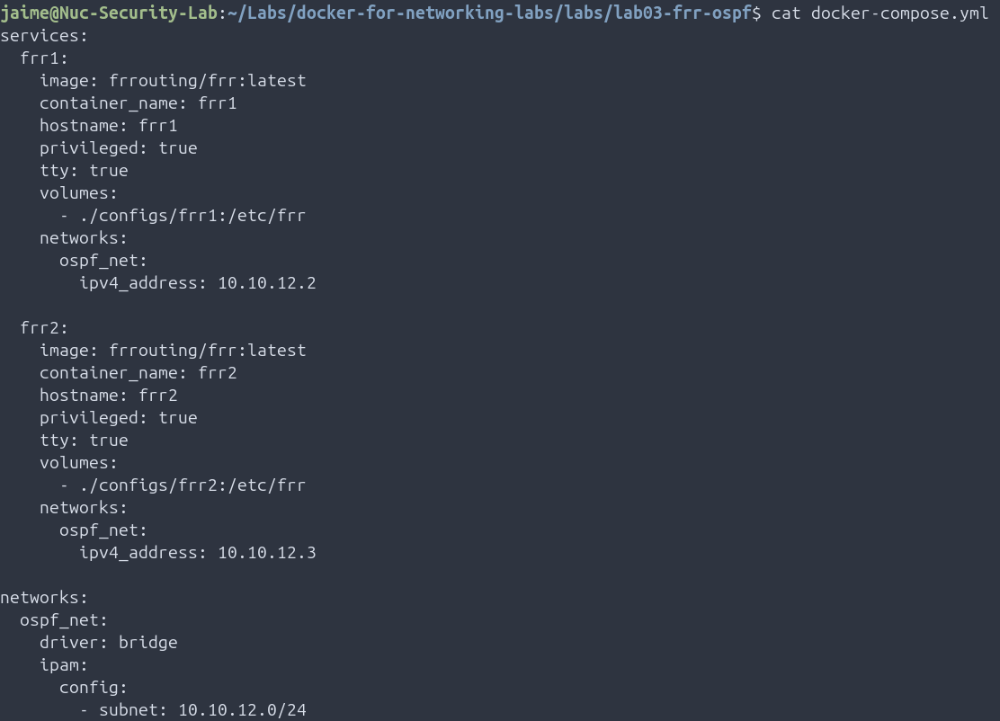
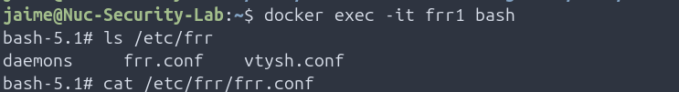
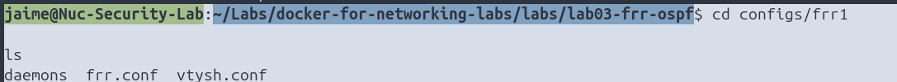
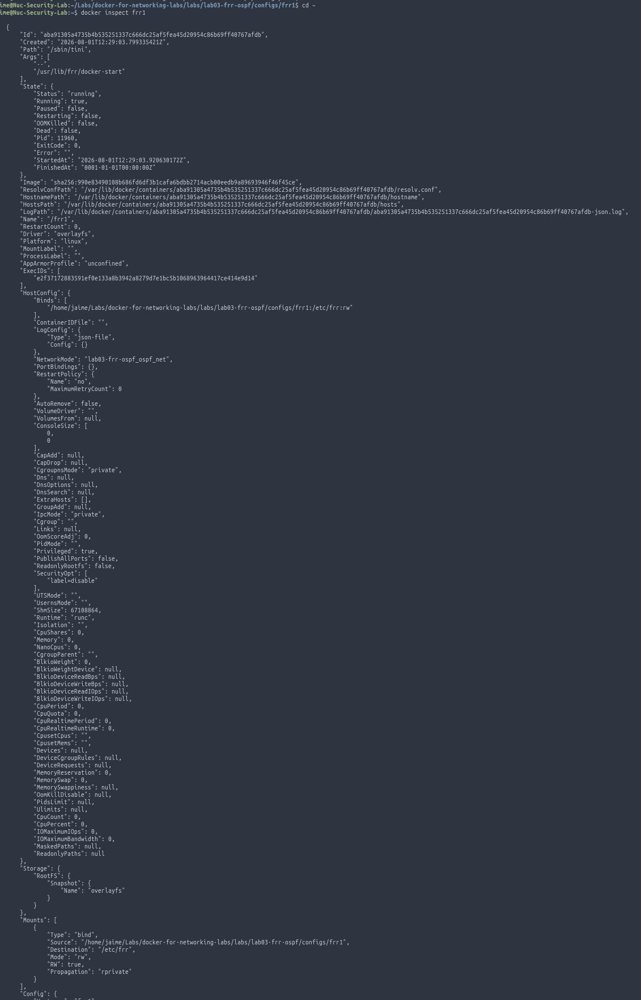

# Lab 03.5 – Understanding Docker Volumes (Bind Mounts)

## Overview

In the previous lab, we mounted the FRRouting configuration directory into the containers using Docker Compose.

This mini lab explains how Docker **Bind Mounts** work and why they are essential for storing and editing router configurations outside the container.

Instead of copying files into the container, Docker shares a directory between the host operating system and the container filesystem.

This approach allows configuration files to persist even if the container is deleted and recreated.

---

# Learning Objectives

After completing this lab you will be able to:

- Understand what a Docker Volume is.
- Differentiate Bind Mounts from Named Volumes.
- Verify how Docker shares files between the host and a container.
- Understand why FRRouting configurations remain persistent.
- Inspect mounted directories inside a container.

---

# Technologies Used

- Docker
- Docker Compose
- Linux
- FRRouting
- Docker Volumes

---

# Lab Topology

```text
                 Ubuntu Host

~/Labs/docker-for-networking-labs/

configs/frr1
        │
        │
        │ Bind Mount
        ▼
+-----------------------------+
|        FRR1 Container       |
|                             |
|        /etc/frr             |
+-----------------------------+
```

---

# What is a Bind Mount?

A **Bind Mount** links an existing directory from the host operating system to a directory inside a Docker container.

Unlike copying files into the container, both locations reference the same data.

Any modification performed on either side is immediately reflected on the other.

---

# Docker Compose Configuration

The following section from the previous lab creates the bind mount:

```yaml
volumes:
  - ./configs/frr1:/etc/frr
```

Meaning:

```text
Host

./configs/frr1

↓

Container

/etc/frr
```

The FRRouting configuration directory on the host becomes available inside the container.

---

# Step 1 – Verify the Mounted Directory

Enter the FRRouting container:

```bash
docker exec -it frr1 bash
```

Verify the mounted directory:

```bash
ls /etc/frr
```

Expected output:

```text
daemons

frr.conf

vtysh.conf
```

---

# Step 2 – Verify the Host Directory

From the host machine:

```bash
cd configs/frr1

ls
```

Expected output:

```text
daemons

frr.conf

vtysh.conf
```

Notice that both directories contain the same files.

---

# Step 3 – Modify the Configuration

Edit the configuration on the host:

```bash
nano configs/frr1/frr.conf
```

Add the following line at the end of the file:

```text
! Docker Volume Test
```

Save the file.

---

# Step 4 – Verify the Change Inside the Container

Inside FRR1:

```bash
cat /etc/frr/frr.conf
```

Expected output:

```text
! Docker Volume Test
```

This demonstrates that Docker is not copying files.

Both locations reference the same filesystem.

---

# Step 5 – Inspect the Docker Mount

Run:

```bash
docker inspect frr1
```

Locate the **Mounts** section.

Example:

```text
Source:

/home/jaime/Labs/docker-for-networking-labs/labs/lab03-frr-ospf/configs/frr1

Destination:

/etc/frr
```

This confirms that Docker mounted the host directory inside the container.

---

# Bind Mount vs Named Volume

## Bind Mount

```text
Host Directory

/home/jaime/configs

↓

Container

/etc/frr
```

Characteristics:

- Managed by the user.
- Easy to edit using Nano, VS Code or Vim.
- Ideal for configuration files.

---

## Named Volume

```text
Docker

↓

/var/lib/docker/volumes/
```

Characteristics:

- Managed by Docker.
- Ideal for databases and persistent application data.
- Docker controls the storage location.

---

# Why Use Bind Mounts?

For networking labs, Bind Mounts provide several advantages:

- Configuration files remain on the host.
- Containers can be recreated without losing configurations.
- Files can be edited using any Linux editor.
- Easy integration with Git repositories.

---

# Verification Commands

```bash
docker exec -it frr1 bash

ls /etc/frr

docker inspect frr1

cat /etc/frr/frr.conf
```

---

# Troubleshooting

## Configuration Changes Are Not Visible

Verify that the bind mount exists:

```bash
docker inspect frr1
```

Check the **Mounts** section.

---

## Wrong Directory Mounted

Verify the Docker Compose configuration:

```yaml
volumes:
  - ./configs/frr1:/etc/frr
```

---

## Container Cannot Read the Files

Verify Linux permissions:

```bash
ls -l configs/frr1
```

---

# Key Takeaways

This lab demonstrates how Docker Bind Mounts allow configuration files to persist outside containers.

Using Bind Mounts is particularly useful for networking labs because router configurations remain available even if the containers are deleted or recreated.

The same technique will be reused throughout the following FRRouting and Containerlab labs.

---

# Skills Demonstrated

- Docker Volumes
- Docker Bind Mounts
- Linux Filesystem
- Docker Compose
- FRRouting Configuration Management

---

# Screenshots

## Docker Compose Configuration



---

## Mounted Directory

## Host Directory



---

## Container Directory



---

## Docker Inspect



