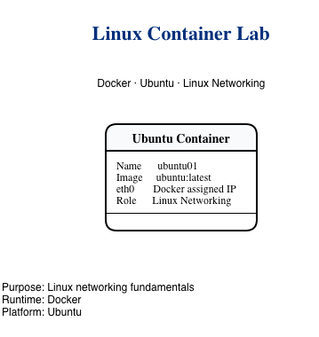
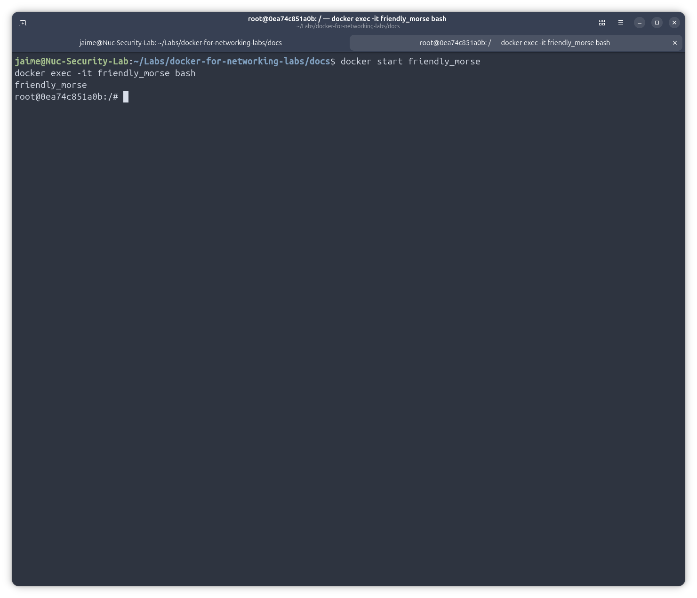
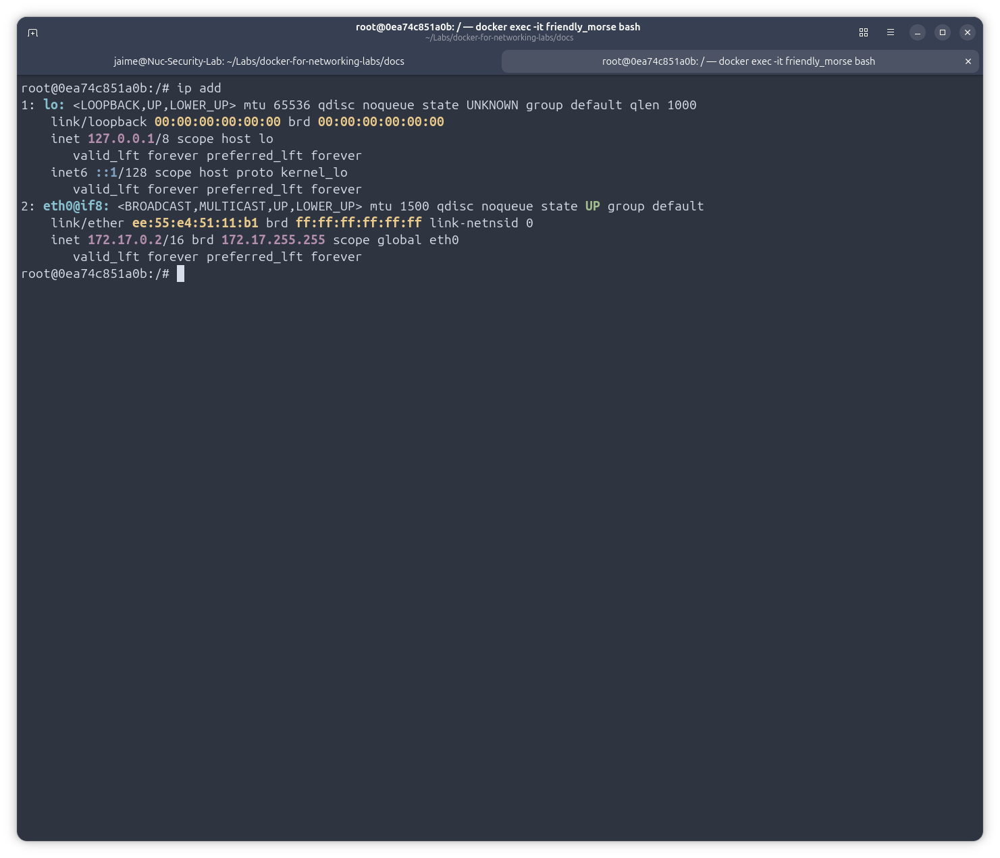
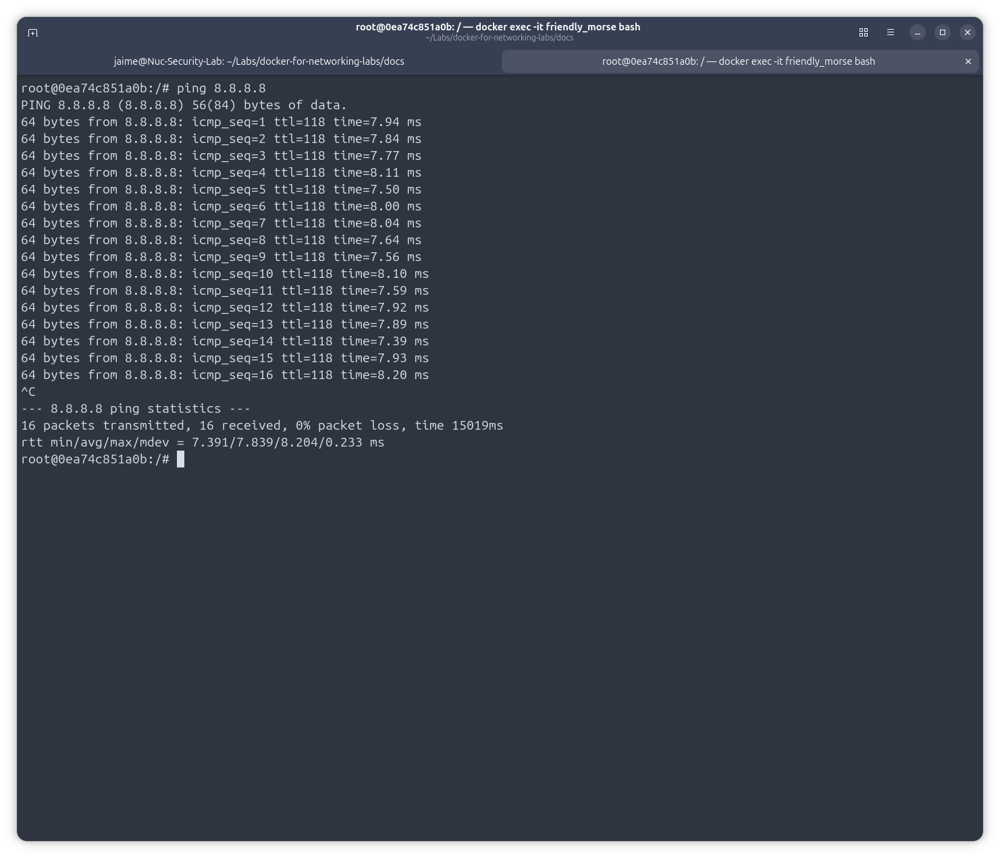

# Lab 01 – Linux Container Fundamentals

## Objective

Deploy a basic Ubuntu container, install networking tools, and verify connectivity using standard Linux networking commands.

---
## Lab Overview



## Topology

```text
+----------------------+
| Ubuntu Host (NUC)    |
| Docker Engine        |
+----------+-----------+
           |
           |
      Docker Bridge
           |
           |
+----------+-----------+
| Ubuntu Container     |
| eth0                 |
| Default Route        |
+----------------------+
```

---

## Prerequisites

* Ubuntu Host
* Docker installed
* Internet connectivity

Verify Docker:

```bash
docker version
```

---

## Step 1 – Download Ubuntu Image

```bash
docker pull ubuntu
```

Verify:

```bash
docker images
```

Expected output:

```text
REPOSITORY   TAG       IMAGE ID
ubuntu       latest    xxxxxxxxx
```

---

## Step 2 – Create an Ubuntu Container

```bash
docker run -it ubuntu bash
```

You should obtain a prompt similar to:

```text
root@container-id:/#
```



---

## Step 3 – Install Networking Tools

The default Ubuntu image is minimal and does not include common networking utilities.

Update repositories:

```bash
apt update
```

Install packages:

```bash
apt install -y iproute2 iputils-ping dnsutils curl
```

---

## Step 4 – Verify Interfaces

```bash
ip addr
```

Expected result:

```text
lo
eth0
```



The container should have an interface named `eth0`.

---

## Step 5 – Verify Routing Table

```bash
ip route
```

Example:

```text
default via 172.17.0.1 dev eth0
172.17.0.0/16 dev eth0 proto kernel
```
---

## Step 6 – Test Connectivity

Ping a public IP address:

```bash
ping -c 4 8.8.8.8
```


Verify DNS resolution:

```bash
ping -c 4 google.com
```

---

## Step 7 – Verify DNS Configuration

```bash
cat /etc/resolv.conf
```

Example:

```text
nameserver 127.0.0.11
```

Docker provides an internal DNS service for containers.

---

## Verification Commands

```bash
hostname
ip addr
ip route
ping -c 4 8.8.8.8
ping -c 4 google.com
cat /etc/resolv.conf
```

---

## Troubleshooting

### Problem: "ip: command not found"

Install iproute2:

```bash
apt update
apt install -y iproute2
```

---

### Problem: No Internet Connectivity

Verify routing:

```bash
ip route
```

Verify Docker bridge:

```bash
docker network inspect bridge
```

---

### Problem: DNS Resolution Fails

Check DNS configuration:

```bash
cat /etc/resolv.conf
```

Test using a public IP:

```bash
ping 8.8.8.8
```

If IP connectivity works but DNS fails, the issue is DNS-related.

---

## Key Concepts Learned

* Docker Images
* Docker Containers
* Docker Networking
* Linux Interfaces
* Linux Routing Table
* DNS Resolution
* Basic Network Troubleshooting

---

## Skills Demonstrated

* Docker Fundamentals
* Linux Networking
* Connectivity Verification
* Troubleshooting Methodology
* Network Operations
