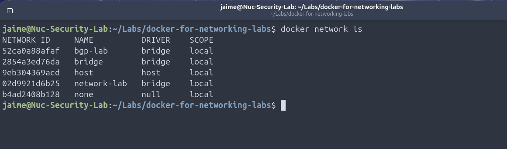
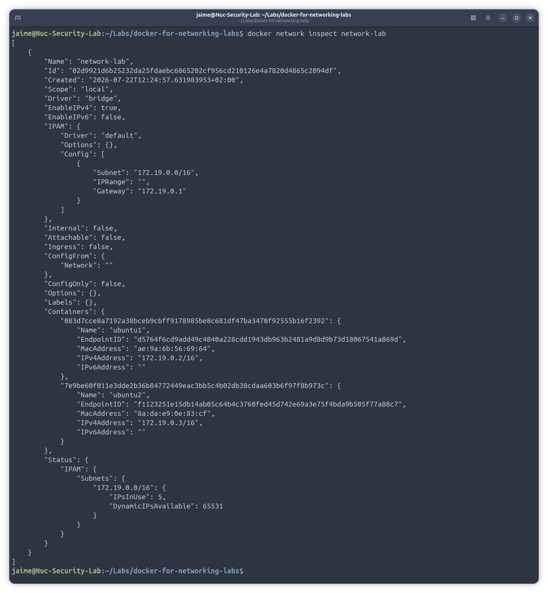
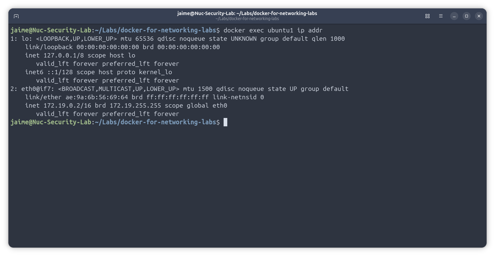
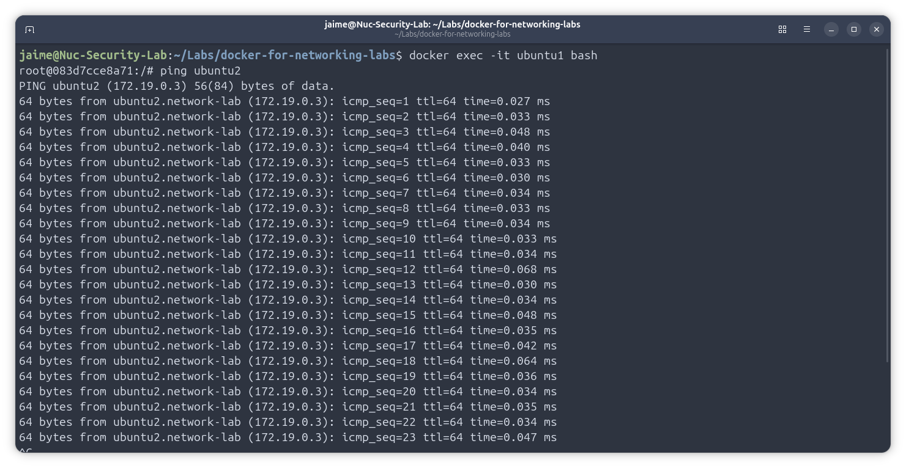
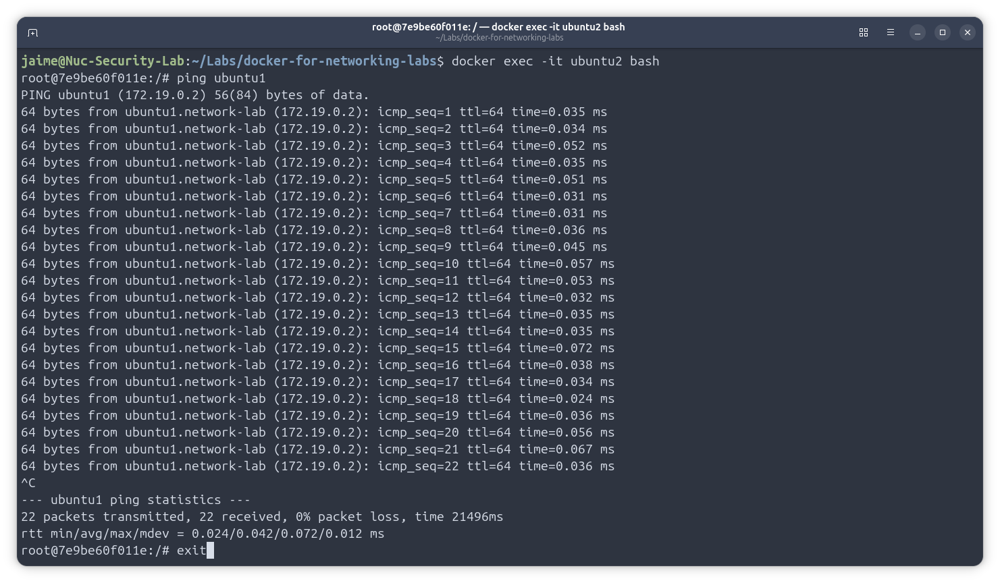

# Lab 02 – Docker Bridge Network

## Overview

This lab introduces Docker networking by creating a custom bridge network and connecting two Ubuntu containers.

The objective is to understand how Docker Bridge provides Layer 2 connectivity between containers, allowing them to communicate as if they were connected to the same virtual switch.

---

# Objectives

By completing this lab you will learn how to:

- Create a custom Docker bridge network.
- Deploy multiple Ubuntu containers.
- Connect containers to the same network.
- Verify IP addressing.
- Test container-to-container connectivity.
- Inspect Docker network configuration.
- Understand Docker's internal DNS resolution.

---

# Topology

```text
                  Ubuntu Host
               Docker Engine
                     │
          Docker Bridge Network
             (network-lab)
         ┌─────────┴─────────┐
         │                   │
  +--------------+    +--------------+
  | Ubuntu-1     |    | Ubuntu-2     |
  | 172.18.0.2   |    | 172.18.0.3   |
  +--------------+    +--------------+
```

---

# Prerequisites

- Ubuntu Linux
- Docker Engine installed
- Internet connectivity

Verify Docker installation:

```bash
docker version
```

---

# Step 1 – List Existing Docker Networks

```bash
docker network ls
```

Expected output:

```text
bridge
host
none
```

---

# Step 2 – Create a Custom Bridge Network

```bash
docker network create network-lab
```

Verify:

```bash
docker network ls
```

---

# Step 3 – Inspect the Network

```bash
docker network inspect network-lab
```

At this stage, no containers should be attached.

---

# Step 4 – Deploy Ubuntu Container 1

```bash
docker run -dit \
--name ubuntu1 \
--network network-lab \
ubuntu bash
```

---

# Step 5 – Deploy Ubuntu Container 2

```bash
docker run -dit \
--name ubuntu2 \
--network network-lab \
ubuntu bash
```

---

# Step 6 – Verify Running Containers

```bash
docker ps
```

Expected output:

```text
ubuntu1
ubuntu2
```

---

# Step 7 – Install Networking Tools

Enter the first container:

```bash
docker exec -it ubuntu1 bash
```

Update packages:

```bash
apt update
```

Install networking utilities:

```bash
apt install -y iproute2 iputils-ping dnsutils
```

Repeat the same process for **ubuntu2**.

---

# Step 8 – Verify IP Addresses

Ubuntu1:

```bash
docker exec ubuntu1 ip addr
```

Ubuntu2:

```bash
docker exec ubuntu2 ip addr
```

Expected addresses:

```text
172.18.0.x
```

---

# Step 9 – Verify Connectivity

Enter Ubuntu1:

```bash
docker exec -it ubuntu1 bash
```

Ping Ubuntu2:

```bash
ping ubuntu2
```

or

```bash
ping <Ubuntu2-IP>
```

Expected result:

```text
64 bytes from ubuntu2...
```

---

# Step 10 – Verify Routing Table

```bash
ip route
```

Example:

```text
default via 172.18.0.1 dev eth0
172.18.0.0/16 dev eth0
```

---

# Step 11 – Inspect the Docker Network

```bash
docker network inspect network-lab
```

You should now see both containers connected to the bridge network.

---

# Verification Commands

```bash
docker ps

docker network ls

docker network inspect network-lab

docker exec ubuntu1 ip addr

docker exec ubuntu2 ip addr

docker exec ubuntu1 ping ubuntu2
```

---

# Troubleshooting

## Problem

The command **ip** is not available.

### Solution

```bash
apt update
apt install -y iproute2
```

---

## Problem

Containers cannot communicate.

### Verify

```bash
docker network inspect network-lab
```

Both containers must appear under **Containers**.

---

## Problem

Container is not running.

Verify:

```bash
docker ps -a
```

Restart:

```bash
docker start ubuntu1
docker start ubuntu2
```

---

# Key Networking Concepts

This lab demonstrates several important networking concepts:

- Docker Bridge acts as a virtual Layer 2 switch.
- Each container is connected through a virtual Ethernet (veth) interface.
- Docker automatically assigns IP addresses.
- Docker provides internal DNS resolution between containers.
- Containers on the same bridge network can communicate without additional configuration.

---

# Skills Demonstrated

- Docker Networking
- Linux Containers
- Docker Bridge
- IP Address Verification
- Connectivity Testing
- Network Troubleshooting

---

# Screenshots

## Docker Networks



---

## Network Inspection



---

## IP Address Verification




---

## Connectivity Test



