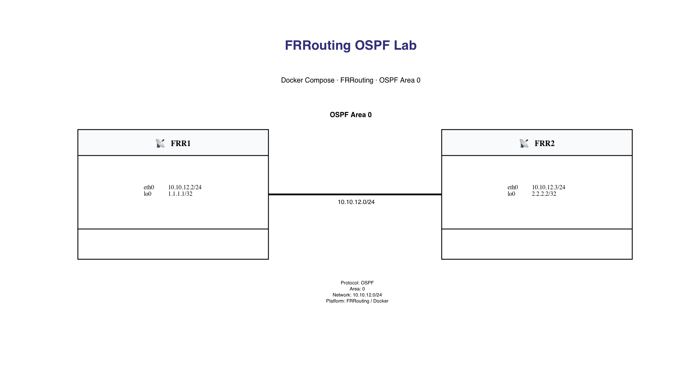

# Lab 03 – FRRouting OSPF with Docker Compose

## Overview

This lab demonstrates how to deploy an OSPF network using **FRRouting (FRR)** containers orchestrated with **Docker Compose**.

Two FRRouting routers are connected through a Docker bridge network and exchange loopback routes using **OSPF Area 0**.

The lab introduces Docker Compose as a simple and scalable way to build routing labs while reinforcing Linux networking and dynamic routing concepts.

---

# Learning Objectives

After completing this lab you will be able to:

- Deploy multiple FRRouting routers using Docker Compose.
- Build a Docker bridge network.
- Configure OSPF Area 0.
- Establish an OSPF adjacency.
- Verify routing information.
- Troubleshoot OSPF neighbors.
- Validate end-to-end IP connectivity.

---

# Technologies Used

- Docker
- Docker Compose
- FRRouting (FRR)
- OSPF
- Linux Networking

---
# Topology



The lab consists of two FRRouting routers connected through the Docker bridge network `ospf_net`.

| Device | Interface | IP Address |
|--------|-----------|------------|
| FRR1 | eth0 | 10.10.12.2/24 |
| FRR1 | lo0 | 1.1.1.1/32 |
| FRR2 | eth0 | 10.10.12.3/24 |
| FRR2 | lo0 | 2.2.2.2/32 |

OSPF Area 0 is enabled across the `10.10.12.0/24` transit network.
---

# Project Structure

```text
lab03-frr-ospf/

├── docker-compose.yml

├── configs/
│   ├── frr1/
│   │   ├── daemons
│   │   ├── frr.conf
│   │   └── vtysh.conf
│   │
│   └── frr2/
│       ├── daemons
│       ├── frr.conf
│       └── vtysh.conf
│
├── images/
│
└── README.md
```

---

# Deploy the Lab

Validate the Docker Compose file:

```bash
docker compose config
```

Deploy the lab:

```bash
docker compose up -d
```

Verify containers:

```bash
docker compose ps
```

Expected output:

```text
frr1   Up
frr2   Up
```

---

# Verify OSPF Neighbor

Connect to FRR1:

```bash
docker exec -it frr1 vtysh
```

Check the OSPF adjacency:

```text
show ip ospf neighbor
```

Expected result:

```text
Neighbor ID     State

2.2.2.2         Full/DR
```

---

# Verify OSPF Routes

```text
show ip route ospf
```

Expected result:

```text
O>* 2.2.2.2/32 via 10.10.12.3
```

Repeat the same verification on FRR2.

---

# Verify End-to-End Connectivity

From FRR1:

```bash
docker exec frr1 ping -c 4 2.2.2.2
```

From FRR2:

```bash
docker exec frr2 ping -c 4 1.1.1.1
```

Expected result:

```text
4 packets transmitted

4 packets received

0% packet loss
```

---

# Verify OSPF Process

```bash
docker exec frr1 ps aux | grep ospfd

docker exec frr2 ps aux | grep ospfd
```

Expected output:

```text
/usr/lib/frr/ospfd
```

---

# Verification Commands

## Docker Verification

Check container status:

```bash
docker compose ps
```

Verify that the OSPF process is running:

```bash
docker exec frr1 ps aux | grep ospfd
docker exec frr2 ps aux | grep ospfd
```

Test loopback connectivity:

```bash
docker exec frr1 ping -c 4 2.2.2.2
docker exec frr2 ping -c 4 1.1.1.1
```

## FRRouting Verification

Connect to FRR1:

```bash
docker exec -it frr1 vtysh
```

Verify OSPF neighbors:

```text
show ip ospf neighbor
```

Verify OSPF-learned routes:

```text
show ip route ospf
```

Verify OSPF interface status:

```text
show ip ospf interface
```

Verify interface information:

```text
show interface eth0
```

The same commands can be executed on FRR2.

---

# Troubleshooting

## OSPF Neighbor Does Not Form

Start by checking the neighbor table:

```text
show ip ospf neighbor
```

If no neighbor appears, verify:

- Both routers are in the same IP subnet.
- Both interfaces participate in OSPF Area 0.
- The OSPF daemon is running.
- The Docker network is operational.
- Interface addressing is correct.

Check the interface:

```text
show interface eth0
```

Check OSPF interface information:

```text
show ip ospf interface
```

## OSPF Neighbor Is Not Full

If a neighbor appears but does not reach the `Full` state, verify:

- Area ID
- Interface addressing
- OSPF timers
- MTU consistency
- Docker connectivity between containers

Check basic connectivity:

```bash
docker exec frr1 ping -c 4 10.10.12.3
docker exec frr2 ping -c 4 10.10.12.2
```

## OSPF Process Not Running

Verify the process:

```bash
docker exec frr1 ps aux | grep ospfd
docker exec frr2 ps aux | grep ospfd
```

If `ospfd` is not running, verify the FRRouting daemon configuration:

```bash
docker exec frr1 cat /etc/frr/daemons
docker exec frr2 cat /etc/frr/daemons
```

The OSPF daemon should be enabled.

## FRRouting Configuration Issues

Verify that the configuration directory is correctly mounted:

```bash
docker inspect frr1
docker inspect frr2
```

Confirm that `/etc/frr` contains:

```text
daemons
frr.conf
vtysh.conf
```

You can verify this directly:

```bash
docker exec frr1 ls -l /etc/frr
docker exec frr2 ls -l /etc/frr
```

## Containers Are Not Running

Check container status:

```bash
docker compose ps
```

Restart the lab if necessary:

```bash
docker compose down
docker compose up -d
```

Check logs if a container fails to start:

```bash
docker compose logs frr1
docker compose logs frr2
```

## OSPF Route Is Missing

Check whether the adjacency is established:

```text
show ip ospf neighbor
```

Then verify the routing table:

```text
show ip route ospf
```

If the neighbor is `Full` but the remote loopback is missing, review the OSPF network statements in `frr.conf`.


---

## Final Validation

OSPF was successfully enabled on both FRRouting containers.

The following processes were verified:

```bash
docker exec frr1 ps aux | grep ospfd
docker exec frr2 ps aux | grep ospfd
```

Expected result:

```text
/usr/lib/frr/watchfrr zebra ospfd staticd
/usr/lib/frr/ospfd -d -F traditional -A 127.0.0.1
```

End-to-end connectivity between the loopback interfaces was also confirmed:

```bash
docker exec frr1 ping -c 4 2.2.2.2
docker exec frr2 ping -c 4 1.1.1.1
```

Results:

```text
4 packets transmitted, 4 packets received, 0% packet loss
```

This confirms that:

- The OSPF adjacency is operational.
- The remote loopback routes are installed.
- Forwarding between both FRRouting containers is working correctly.


# Lab Validation

The lab was successfully validated with:

- OSPF adjacency in Full state.
- Dynamic route exchange.
- Successful loopback reachability.
- Docker Compose deployment.
- FRRouting operational.

---

# Skills Demonstrated

- Docker Compose
- Docker Networking
- Linux Networking
- FRRouting
- OSPF
- Dynamic Routing
- Network Troubleshooting

---

# Screenshots

## Docker Compose


---

## OSPF Neighbor


---

## OSPF Routes


---

## End-to-End Connectivity


# Key Takeaways

This lab demonstrates how Docker Compose can be used to build reproducible routing environments with FRRouting.

Key concepts practiced:

- Docker bridge networking
- Multi-container routing labs
- FRRouting configuration
- OSPF Area 0
- OSPF neighbor formation
- Dynamic route exchange
- Loopback reachability
- Docker and FRRouting troubleshooting
- Persistent configuration through bind mounts


# Completed Labs

✅ Linux Container Fundamentals

✅ Docker Bridge Network

✅ FRRouting OSPF with Docker Compose


# Upcoming Labs

🔹 FRRouting BGP

🔹 Containerlab Introduction

🔹 VXLAN Concepts

🔹 EVPN
