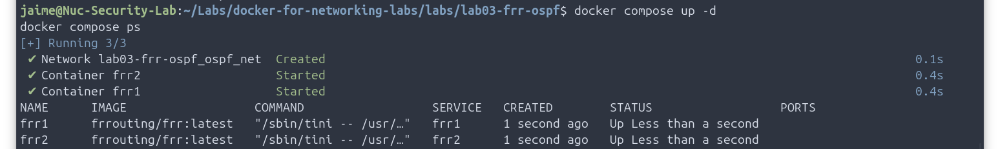
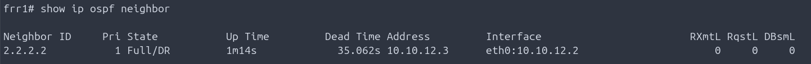
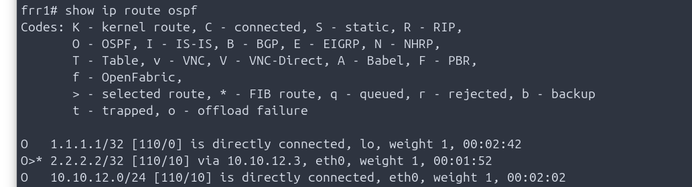
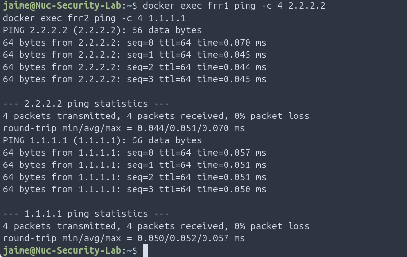

# Lab 03 – FRRouting OSPF with Docker Compose

## Overview

This lab demonstrates how to deploy an OSPF network using **FRRouting (FRR)** containers orchestrated with **Docker Compose**.

Two FRRouting routers are connected through a Docker bridge network and exchange loopback routes using **OSPF Area 0**.

The lab introduces Docker Compose as a simple and scalable way to build routing labs while reinforcing Linux networking and dynamic routing concepts.

---

# Learning Objectives

After completing this lab you will be able to:

- Deploy multiple FRRouting routers using Docker Compose.
- Build a Docker bridge network.
- Configure OSPF Area 0.
- Establish an OSPF adjacency.
- Verify routing information.
- Troubleshoot OSPF neighbors.
- Validate end-to-end IP connectivity.

---

# Technologies Used

- Docker
- Docker Compose
- FRRouting (FRR)
- OSPF
- Linux Networking

---

# Topology

```text
                OSPF Area 0

      10.10.12.0/24

+-----------------------------+
|       Docker Network        |
|         ospf_net            |
+-------------+---------------+
              |
      -----------------
      |               |
+------------+   +------------+
|   FRR1     |---|   FRR2     |
| 10.10.12.2 |   | 10.10.12.3 |
| RID 1.1.1.1|   | RID 2.2.2.2|
+------------+   +------------+

Loopbacks

FRR1 → 1.1.1.1/32

FRR2 → 2.2.2.2/32
```

---

# Project Structure

```text
lab03-frr-ospf/

├── docker-compose.yml

├── configs/
│   ├── frr1/
│   │   ├── daemons
│   │   ├── frr.conf
│   │   └── vtysh.conf
│   │
│   └── frr2/
│       ├── daemons
│       ├── frr.conf
│       └── vtysh.conf
│
├── images/
│
└── README.md
```

---

# Deploy the Lab

Validate the Docker Compose file:

```bash
docker compose config
```

Deploy the lab:

```bash
docker compose up -d
```

Verify containers:

```bash
docker compose ps
```

Expected output:

```text
frr1   Up
frr2   Up
```

---

# Verify OSPF Neighbor

Connect to FRR1:

```bash
docker exec -it frr1 vtysh
```

Check the OSPF adjacency:

```text
show ip ospf neighbor
```

Expected result:

```text
Neighbor ID     State

2.2.2.2         Full/DR
```

---

# Verify OSPF Routes

```text
show ip route ospf
```

Expected result:

```text
O>* 2.2.2.2/32 via 10.10.12.3
```

Repeat the same verification on FRR2.

---

# Verify End-to-End Connectivity

From FRR1:

```bash
docker exec frr1 ping -c 4 2.2.2.2
```

From FRR2:

```bash
docker exec frr2 ping -c 4 1.1.1.1
```

Expected result:

```text
4 packets transmitted

4 packets received

0% packet loss
```

---

# Verify OSPF Process

```bash
docker exec frr1 ps aux | grep ospfd

docker exec frr2 ps aux | grep ospfd
```

Expected output:

```text
/usr/lib/frr/ospfd
```

---

# Verification Commands

```bash
docker compose ps

docker exec -it frr1 vtysh

show ip ospf neighbor

show ip route ospf

docker exec frr1 ping -c 4 2.2.2.2

docker exec frr2 ping -c 4 1.1.1.1
```

---

# Troubleshooting

## OSPF Neighbor Does Not Form

Verify:

```text
show ip ospf neighbor
```

Check that both routers belong to the same subnet and Area 0.

---

## OSPF Process Not Running

Verify:

```bash
docker exec frr1 ps aux | grep ospfd
```

If no process appears, verify the **daemons** file.

---

## Containers Are Not Running

```bash
docker compose ps
```

Restart the lab:

```bash
docker compose down

docker compose up -d
```

---

## Docker Compose Validation

```bash
docker compose config
```

Use this command before deploying the topology to detect YAML syntax errors.

---

## Final Validation

OSPF was successfully enabled on both FRRouting containers.

The following processes were verified:

```bash
docker exec frr1 ps aux | grep ospfd
docker exec frr2 ps aux | grep ospfd
```

Expected result:

```text
/usr/lib/frr/watchfrr zebra ospfd staticd
/usr/lib/frr/ospfd -d -F traditional -A 127.0.0.1
```

End-to-end connectivity between the loopback interfaces was also confirmed:

```bash
docker exec frr1 ping -c 4 2.2.2.2
docker exec frr2 ping -c 4 1.1.1.1
```

Results:

```text
4 packets transmitted, 4 packets received, 0% packet loss
```

This confirms that:

- The OSPF adjacency is operational.
- The remote loopback routes are installed.
- Forwarding between both FRRouting containers is working correctly.


# Lab Validation

The lab was successfully validated with:

- OSPF adjacency in Full state.
- Dynamic route exchange.
- Successful loopback reachability.
- Docker Compose deployment.
- FRRouting operational.

---

# Skills Demonstrated

- Docker Compose
- Docker Networking
- Linux Networking
- FRRouting
- OSPF
- Dynamic Routing
- Network Troubleshooting

---

# Screenshots

## Docker Compose



---

## OSPF Neighbor



---

## OSPF Routes



---

## End-to-End Connectivity




# Key Takeaways

This lab demonstrates how Docker Compose can be used to deploy reproducible routing environments with FRRouting.

Using containers significantly reduces the resources required compared to traditional virtual machines while providing an excellent platform for learning routing protocols such as OSPF and BGP.

The same deployment model can be easily extended to larger topologies or migrated to Containerlab for more advanced networking scenarios.


# Completed Labs

✅ Linux Container Fundamentals

✅ Docker Bridge Network

✅ FRRouting OSPF with Docker Compose


# Upcoming Labs

🔹 FRRouting BGP

🔹 Containerlab Introduction

🔹 VXLAN Concepts

🔹 EVPN
