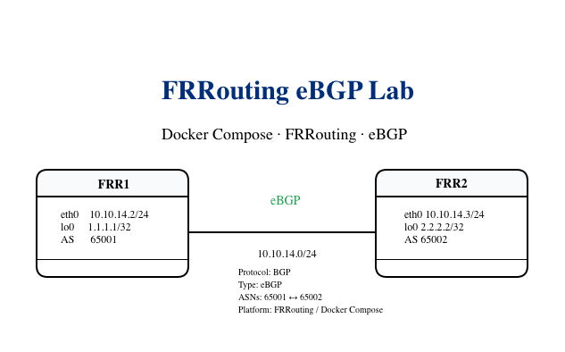
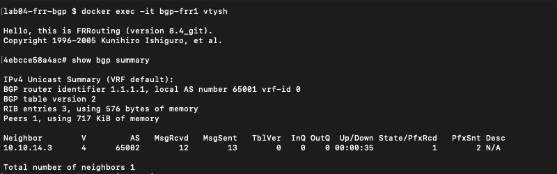
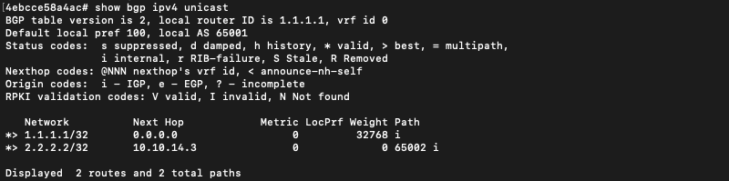
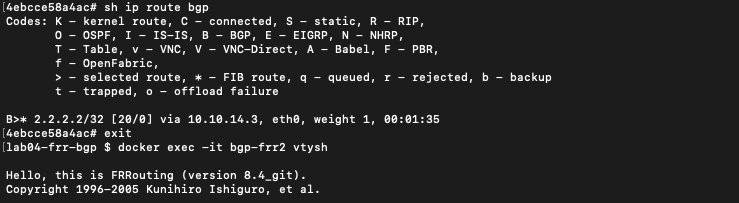
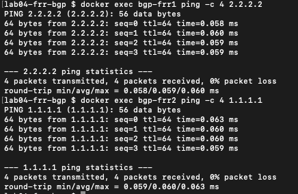

# Lab 04 – FRRouting eBGP with Docker Compose

## Overview

This lab demonstrates how to deploy an eBGP network using **FRRouting (FRR)** containers orchestrated with **Docker Compose**.

Two FRRouting routers operate in different Autonomous Systems and establish an **eBGP session** across a Docker bridge network.

Each router advertises a loopback prefix through BGP and installs the remote prefix in its routing table.

The lab also introduces BGP policy behavior and troubleshooting using FRRouting.

---

# Learning Objectives

After completing this lab you will be able to:

- Deploy multiple FRRouting routers using Docker Compose.
- Configure eBGP between different Autonomous Systems.
- Understand `local-as` and `remote-as`.
- Advertise loopback networks through BGP.
- Verify BGP neighbor establishment.
- Inspect the BGP table.
- Verify BGP routes installed in the routing table.
- Validate end-to-end loopback connectivity.
- Troubleshoot BGP policy issues in FRRouting.

---

# Technologies Used

- Docker
- Docker Compose
- FRRouting
- BGP
- Linux Networking

---

# Topology



The lab uses two FRRouting routers connected through the Docker bridge network `bgp_net`.

| Device | Interface | IP Address | ASN |
|---|---|---|---|
| FRR1 | eth0 | 10.10.14.2/24 | 65001 |
| FRR1 | lo0 | 1.1.1.1/32 | 65001 |
| FRR2 | eth0 | 10.10.14.3/24 | 65002 |
| FRR2 | lo0 | 2.2.2.2/32 | 65002 |

The eBGP session is established across the `10.10.14.0/24` transit network.

---

# Project Structure

```text
lab04-frr-bgp/
├── configs/
│   ├── frr1/
│   │   ├── daemons
│   │   ├── frr.conf
│   │   └── vtysh.conf
│   └── frr2/
│       ├── daemons
│       ├── frr.conf
│       └── vtysh.conf
├── images/
│   ├── bgp-route-frr1.png
│   ├── bgp-summary-frr1.png
│   ├── bgp-table-frr1.png
│   ├── lab04-frr-ebgp-topology.png
│   └── ping-loopbacks.png
├── docker-compose.yml
└── README.md
```

---

# Deploy the Lab

Validate the Docker Compose configuration:

```bash
docker compose config
```

Start the lab:

```bash
docker compose up -d
```

Verify container status:

```bash
docker compose ps
```

Expected containers:

```text
bgp-frr1
bgp-frr2
```

---

# Verify BGP Process

Verify that the BGP daemon is running:

```bash
docker exec bgp-frr1 ps aux | grep bgpd
docker exec bgp-frr2 ps aux | grep bgpd
```

Expected process:

```text
/usr/lib/frr/bgpd
```

---

# Verify BGP Neighbor

Connect to FRR1:

```bash
docker exec -it bgp-frr1 vtysh
```

Verify the BGP session:

```text
show bgp summary
```

Expected neighbor:

```text
Neighbor      AS      State/PfxRcd
10.10.14.3    65002   1
```

Screenshot:



---

# Verify BGP Table

Display the IPv4 BGP table:

```text
show bgp ipv4 unicast
```

FRR1 should learn the remote loopback prefix:

```text
2.2.2.2/32
```

with next-hop:

```text
10.10.14.3
```

Screenshot:



---

# Verify BGP Route Installation

Verify routes installed by BGP:

```text
show ip route bgp
```

FRR1 should install the remote loopback route through FRR2.

Screenshot:



This demonstrates the routing workflow:

```text
BGP Neighbor
      ↓
BGP Table
      ↓
Best Path Selection
      ↓
Routing Table
```

---

# Verify End-to-End Connectivity

From FRR1:

```bash
docker exec bgp-frr1 ping -c 4 2.2.2.2
```

From FRR2:

```bash
docker exec bgp-frr2 ping -c 4 1.1.1.1
```

Expected result:

```text
4 packets transmitted
4 packets received
0% packet loss
```

Screenshot:



---

# Verification Commands

## Docker

```bash
docker compose ps
docker exec bgp-frr1 ps aux | grep bgpd
docker exec bgp-frr2 ps aux | grep bgpd
```

## FRRouting

```text
show bgp summary
show bgp ipv4 unicast
show ip route bgp
show bgp ipv4 unicast neighbors
```

---

# Troubleshooting

## BGP Neighbor Does Not Establish

Start with:

```text
show bgp summary
```

Verify:

- Neighbor IP address
- Local ASN
- Remote ASN
- IP reachability
- BGP daemon status
- Docker network connectivity

Test the transit network:

```bash
docker exec bgp-frr1 ping -c 4 10.10.14.3
docker exec bgp-frr2 ping -c 4 10.10.14.2
```

---

## Incorrect Remote AS

A common BGP configuration error is an incorrect `remote-as`.

Example:

```text
neighbor 10.10.14.3 remote-as 65003
```

If FRR2 is actually using AS `65002`, the BGP session will not establish correctly.

Verify the neighbor configuration:

```text
show running-config
show bgp summary
```

---

## BGP Policy Issue

During this lab, the BGP session established successfully but FRRouting displayed:

```text
(Policy) (Policy)
```

in the `State/PfxRcd` output.

The routers exchanged BGP messages, but prefixes were not being accepted or advertised because no explicit import/export policy was configured.

The issue was resolved using a permit-all route-map:

```text
route-map PERMIT-ALL permit 10
```

and applying it to the BGP neighbor:

```text
neighbor 10.10.14.3 route-map PERMIT-ALL in
neighbor 10.10.14.3 route-map PERMIT-ALL out
```

The equivalent configuration was applied on FRR2.

After applying the policy, the BGP table successfully exchanged the loopback prefixes.

---

## BGP Prefix Is Not Advertised

If the BGP session is established but a prefix does not appear in the neighbor's BGP table, verify that the prefix exists in the local routing table.

For example:

```text
network 1.1.1.1/32
```

requires the corresponding route to exist locally.

Verify:

```text
show ip route
show bgp ipv4 unicast
```

---

## BGP Process Not Running

Verify:

```bash
docker exec bgp-frr1 ps aux | grep bgpd
```

If `bgpd` is missing, verify:

```bash
docker exec bgp-frr1 cat /etc/frr/daemons
```

The configuration should include:

```text
bgpd=yes
```

---

## Containers Are Not Running

Check:

```bash
docker compose ps
```

Restart if necessary:

```bash
docker compose down
docker compose up -d
```

Check logs:

```bash
docker compose logs bgp-frr1
docker compose logs bgp-frr2
```

---

# Key Takeaways

This lab demonstrates how Docker Compose and FRRouting can be used to build a reproducible eBGP environment.

Key concepts practiced:

- Docker bridge networking
- FRRouting BGP configuration
- Autonomous Systems
- eBGP neighbor establishment
- BGP prefix advertisement
- BGP table inspection
- Route installation into the RIB
- Loopback reachability
- BGP policy behavior
- Troubleshooting with FRRouting
