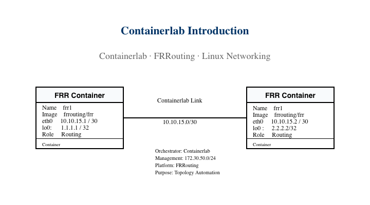
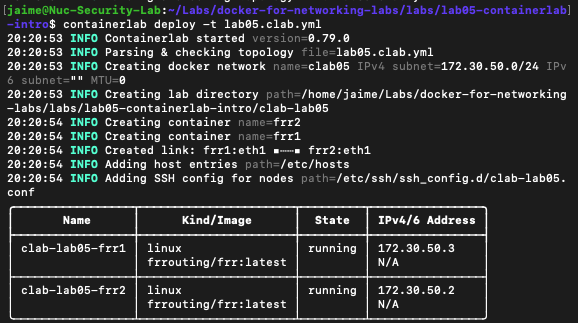
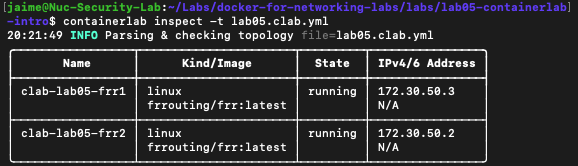
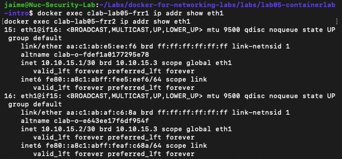
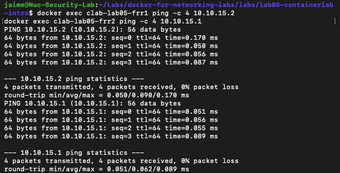

# Lab 05 – Containerlab Introduction with FRRouting

## Overview

This lab introduces **Containerlab** as a network lab orchestration platform using two **FRRouting (FRR)** containers.

The topology is defined in a single `.clab.yml` file and automatically deployed by Containerlab.

The lab focuses on understanding:

- Containerlab topology files
- Automated node creation
- Point-to-point links
- Management networking
- FRRouting configuration
- Basic connectivity validation
- Containerlab troubleshooting

---

# Learning Objectives

After completing this lab you will be able to:

- Install and verify Containerlab.
- Understand the structure of a `.clab.yml` topology file.
- Deploy FRRouting containers using Containerlab.
- Create point-to-point links between network nodes.
- Configure IP addressing using FRRouting.
- Inspect deployed Containerlab nodes.
- Understand the difference between management and lab interfaces.
- Validate IP connectivity between routers.
- Destroy and redeploy a topology.
- Troubleshoot Containerlab management network conflicts.

---

# Technologies Used

- Containerlab
- Docker
- FRRouting
- Linux Networking
- YAML

---

# Topology



The lab consists of two FRRouting nodes connected through a Containerlab point-to-point link.

| Device | Interface | IP Address |
|---|---|---|
| FRR1 | eth1 | 10.10.15.1/30 |
| FRR1 | lo0 | 1.1.1.1/32 |
| FRR2 | eth1 | 10.10.15.2/30 |
| FRR2 | lo0 | 2.2.2.2/32 |

The point-to-point transit network is:

```text
10.10.15.0/30
```

Containerlab also creates a separate management network:

```text
172.30.50.0/24
```

This management network is independent from the topology link between FRR1 and FRR2.

---

# Project Structure

```text
lab05-containerlab-intro/
├── configs/
│   ├── frr1/
│   │   ├── daemons
│   │   ├── frr.conf
│   │   └── vtysh.conf
│   └── frr2/
│       ├── daemons
│       ├── frr.conf
│       └── vtysh.conf
├── images/
│   ├── containerlab-deploy.png
│   ├── containerlab-inspect.png
│   ├── frr1-eth1-ip.png
│   ├── lab05-containerlab-topology.png
│   └── ping-frr1-frr2.png
├── lab05.clab.yml
└── README.md
```

---

# Containerlab Topology File

The topology is defined in:

```text
lab05.clab.yml
```

Example:

```yaml
name: lab05

mgmt:
  network: clab05
  ipv4-subnet: 172.30.50.0/24

topology:
  nodes:

    frr1:
      kind: linux
      image: frrouting/frr:latest
      binds:
        - ./configs/frr1:/etc/frr

    frr2:
      kind: linux
      image: frrouting/frr:latest
      binds:
        - ./configs/frr2:/etc/frr

  links:
    - endpoints:
        - frr1:eth1
        - frr2:eth1
```

This topology defines:

- Two Linux containers running FRRouting
- Persistent FRR configuration through bind mounts
- One point-to-point link
- One dedicated management network

---

# Deploy the Lab

Verify Containerlab:

```bash
containerlab version
```

Deploy the topology:

```bash
containerlab deploy -t lab05.clab.yml
```

Containerlab automatically:

- Creates the management network
- Creates the containers
- Creates the point-to-point link
- Adds host entries
- Creates SSH configuration entries

Screenshot:



---

# Inspect the Lab

Display the deployed topology:

```bash
containerlab inspect -t lab05.clab.yml
```

Expected nodes:

```text
clab-lab05-frr1
clab-lab05-frr2
```

The management addresses should belong to:

```text
172.30.50.0/24
```

Screenshot:



---

# Verify Container Interfaces

Verify FRR1:

```bash
docker exec clab-lab05-frr1 ip addr show eth1
```

Expected address:

```text
10.10.15.1/30
```

Verify FRR2:

```bash
docker exec clab-lab05-frr2 ip addr show eth1
```

Expected address:

```text
10.10.15.2/30
```

Screenshot:



---

# Verify FRRouting

Connect to FRR1:

```bash
docker exec -it clab-lab05-frr1 vtysh
```

Verify interface information:

```text
show interface eth1
```

Verify the routing table:

```text
show ip route
```

The connected network should appear as:

```text
10.10.15.0/30
```

---

# Verify Connectivity

From FRR1:

```bash
docker exec clab-lab05-frr1 ping -c 4 10.10.15.2
```

From FRR2:

```bash
docker exec clab-lab05-frr2 ping -c 4 10.10.15.1
```

Expected result:

```text
4 packets transmitted
4 packets received
0% packet loss
```

Screenshot:



---

# Management Network vs Lab Network

Containerlab creates a separate Docker management network for node management.

In this lab:

```text
Management Network
172.30.50.0/24
```

The topology link uses:

```text
Lab Network
10.10.15.0/30
```

Conceptually:

```text
Management Plane
172.30.50.0/24
        |
        |
   Containerlab
     /      \
  FRR1      FRR2
     \      /
    10.10.15.0/30
       Data Plane
```

The management network should not be confused with the point-to-point network used by the lab topology.

---

# Verification Commands

## Containerlab

```bash
containerlab version
containerlab inspect -t lab05.clab.yml
```

## Docker

```bash
docker ps
docker network ls
docker exec clab-lab05-frr1 ip addr show eth1
docker exec clab-lab05-frr2 ip addr show eth1
```

## FRRouting

```bash
docker exec -it clab-lab05-frr1 vtysh
```

Inside FRR:

```text
show interface eth1
show ip route
```

## Connectivity

```bash
docker exec clab-lab05-frr1 ping -c 4 10.10.15.2
docker exec clab-lab05-frr2 ping -c 4 10.10.15.1
```

---

# Troubleshooting

## Containerlab Command Not Found

If:

```text
containerlab: command not found
```

verify whether Containerlab is installed:

```bash
which containerlab
containerlab version
```

---

## Docker Management Network Conflict

During the initial deployment, Containerlab attempted to create its default management network:

```text
172.20.20.0/24
```

Docker rejected the request because an existing Docker network was already using:

```text
172.20.0.0/16
```

The deployment failed with an overlapping subnet error.

The issue was resolved by defining a dedicated management network in the topology file:

```yaml
mgmt:
  network: clab05
  ipv4-subnet: 172.30.50.0/24
```

After the change, the topology deployed successfully.

This demonstrates the importance of checking existing Docker networks before assigning management subnets.

Useful command:

```bash
docker network ls
```

---

## Node Is Not Running

Inspect the topology:

```bash
containerlab inspect -t lab05.clab.yml
```

Check Docker:

```bash
docker ps -a
```

Inspect logs:

```bash
docker logs clab-lab05-frr1
docker logs clab-lab05-frr2
```

---

## Interface Does Not Have the Expected IP

Verify the interface:

```bash
docker exec clab-lab05-frr1 ip addr show eth1
```

If the IP is missing, verify:

```text
configs/frr1/frr.conf
configs/frr2/frr.conf
```

Also confirm that the configuration directory is correctly mounted into:

```text
/etc/frr
```

---

## Point-to-Point Connectivity Fails

Check both interfaces:

```bash
docker exec clab-lab05-frr1 ip addr show eth1
docker exec clab-lab05-frr2 ip addr show eth1
```

Verify that both addresses belong to:

```text
10.10.15.0/30
```

Then test connectivity:

```bash
docker exec clab-lab05-frr1 ping -c 4 10.10.15.2
```

---

# Destroy the Lab

Containerlab makes topology cleanup simple.

Destroy the topology:

```bash
containerlab destroy -t lab05.clab.yml
```

Verify:

```bash
containerlab inspect -t lab05.clab.yml
docker ps
```

The lab can later be recreated with:

```bash
containerlab deploy -t lab05.clab.yml
```

This is one of the main advantages of topology-as-code.

---

# Docker Compose vs Containerlab

| Docker Compose | Containerlab |
|---|---|
| General-purpose container orchestration | Network lab orchestration |
| Containers defined in Compose YAML | Network nodes defined in topology YAML |
| Networks configured manually | Links declared directly between endpoints |
| Good for application/container stacks | Designed for network topologies |
| Requires more manual network wiring | Automatically creates network links |
| Useful for FRR labs | Excellent for larger network labs |

Containerlab provides a more natural workflow for network engineers because the topology itself becomes code.

---

# Key Takeaways

This lab introduces Containerlab as a reproducible network lab platform.

Key concepts practiced:

- Network topology as code
- Containerlab topology files
- FRRouting containers
- Point-to-point links
- Management networking
- Docker integration
- Bind-mounted configurations
- Interface verification
- IP connectivity
- Network overlap troubleshooting
- Automated deployment and cleanup

The main workflow is:

```text
Define Topology
      ↓
Deploy
      ↓
Inspect
      ↓
Verify
      ↓
Troubleshoot
      ↓
Destroy
      ↓
Redeploy
```
