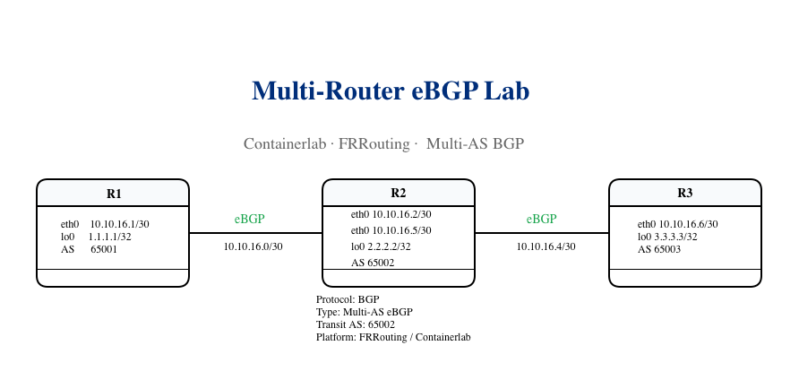
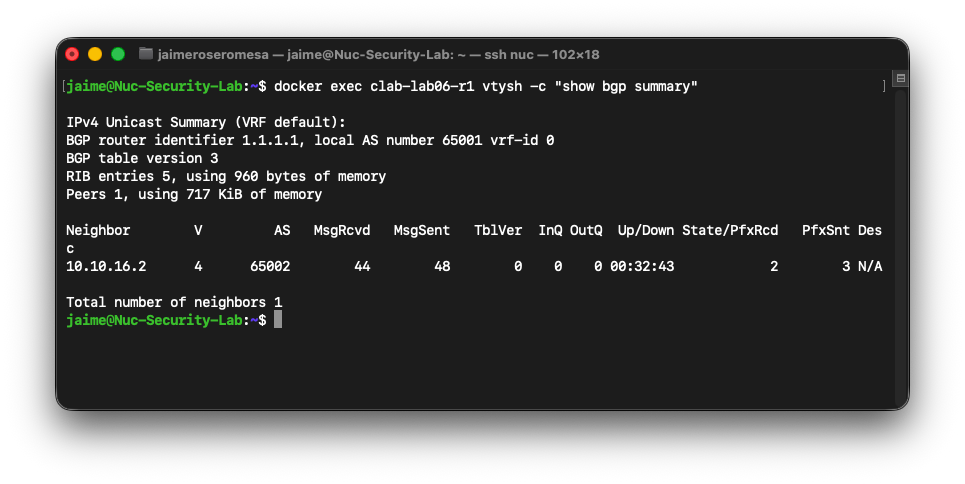
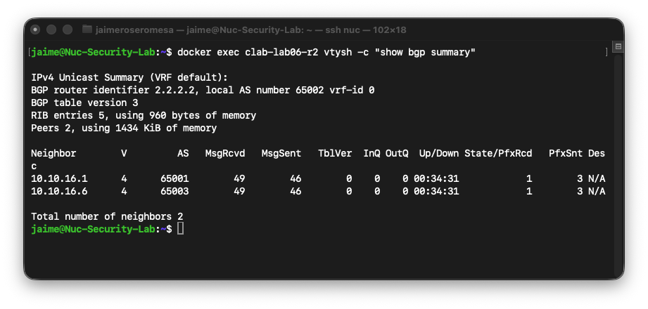
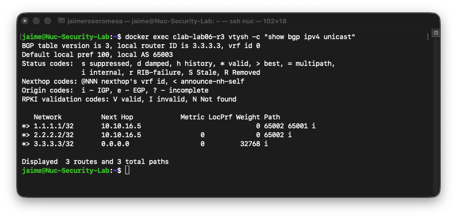
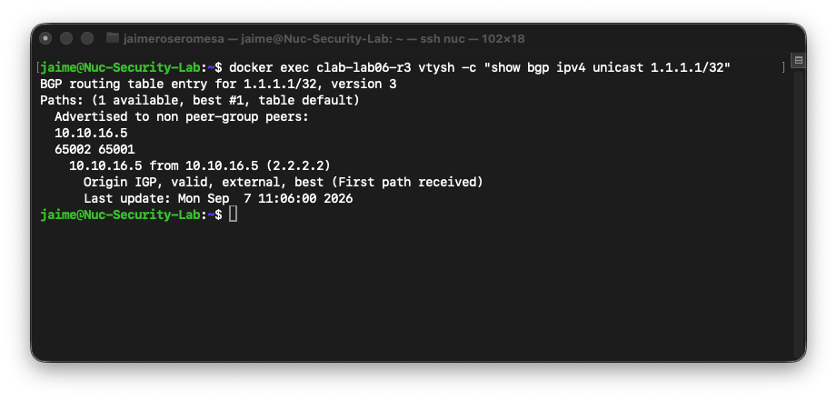
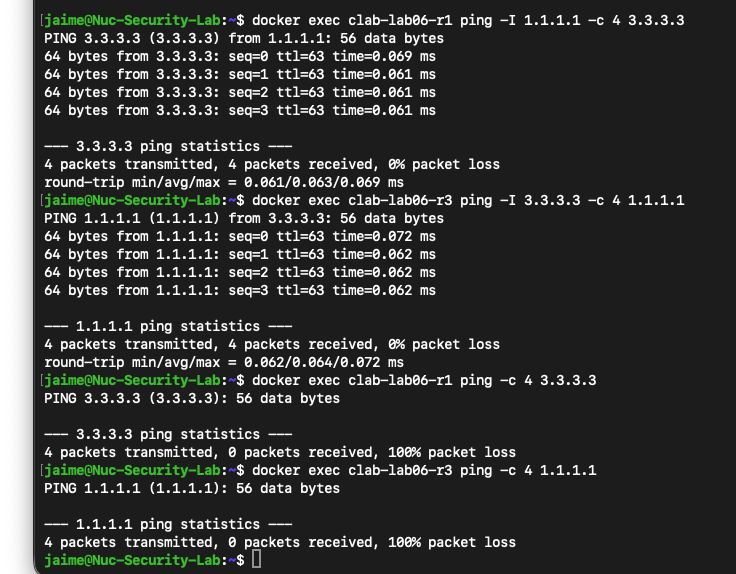

# Lab06 – Multi-Router eBGP with Containerlab

## Overview

This lab builds a three-router eBGP topology using **Containerlab** and **FRRouting (FRR)**.

The goal is to move beyond a single eBGP peering and observe how BGP routes are propagated across multiple autonomous systems.

R2 operates as a **transit AS**, learning routes from R1 and advertising them toward R3, and vice versa.

This lab focuses on:

- Multi-router eBGP
- AS_PATH propagation
- Transit autonomous systems
- BGP route advertisement
- Next-hop behavior
- End-to-end connectivity
- Return-path troubleshooting

---

## Learning Objectives

By completing this lab, you will be able to:

- Deploy a multi-router topology with Containerlab
- Configure eBGP between three autonomous systems
- Verify BGP neighbor relationships
- Understand how the AS_PATH attribute changes across AS boundaries
- Identify locally originated and remotely learned routes
- Verify BGP next-hop information
- Troubleshoot missing return paths
- Validate end-to-end connectivity using advertised loopbacks

---

## Technologies

- Docker
- Containerlab
- FRRouting
- BGP
- Linux Networking

---

## Topology



The topology consists of three FRRouting routers, each operating in a different autonomous system.

```text
        AS65001             AS65002             AS65003

      1.1.1.1/32          2.2.2.2/32          3.3.3.3/32
          R1 ---------------- R2 ---------------- R3
              10.10.16.0/30      10.10.16.4/30
```

R2 acts as the transit autonomous system between R1 and R3.

---

## Addressing Plan

| Router | Interface | IP Address | Autonomous System |
|---|---|---|---|
| R1 | eth1 | 10.10.16.1/30 | 65001 |
| R1 | lo | 1.1.1.1/32 | 65001 |
| R2 | eth1 | 10.10.16.2/30 | 65002 |
| R2 | eth2 | 10.10.16.5/30 | 65002 |
| R2 | lo | 2.2.2.2/32 | 65002 |
| R3 | eth1 | 10.10.16.6/30 | 65003 |
| R3 | lo | 3.3.3.3/32 | 65003 |

The point-to-point networks are:

```text
R1 ↔ R2
10.10.16.0/30

R2 ↔ R3
10.10.16.4/30
```

---

## Management Network

Containerlab uses a dedicated management network:

```text
172.30.60.0/24
```

The topology file creates the Docker network:

```text
clab06
```

The management network is separate from the routing links used by BGP.

---

## Project Structure

```text
lab06-multirouter-bgp/
├── configs/
│   ├── r1/
│   │   ├── daemons
│   │   ├── frr.conf
│   │   └── vtysh.conf
│   ├── r2/
│   │   ├── daemons
│   │   ├── frr.conf
│   │   └── vtysh.conf
│   └── r3/
│       ├── daemons
│       ├── frr.conf
│       └── vtysh.conf
├── images/
│   ├── lab06-multirouter-ebgp-topology.png
│   ├── bgp-summary-r1.png
│   ├── bgp-summary-r2.png
│   ├── bgp-table-r3.png
│   ├── bgp-path-r3.png
│   └── ping-r1-r3.png
├── lab06.clab.yml
└── README.md
```

---

## Containerlab Topology

The lab is defined in:

```text
lab06.clab.yml
```

Example:

```yaml
name: lab06

mgmt:
  network: clab06
  ipv4-subnet: 172.30.60.0/24

topology:
  nodes:

    r1:
      kind: linux
      image: frrouting/frr:latest
      binds:
        - ./configs/r1:/etc/frr

    r2:
      kind: linux
      image: frrouting/frr:latest
      binds:
        - ./configs/r2:/etc/frr

    r3:
      kind: linux
      image: frrouting/frr:latest
      binds:
        - ./configs/r3:/etc/frr

  links:
    - endpoints:
        - r1:eth1
        - r2:eth1

    - endpoints:
        - r2:eth2
        - r3:eth1
```

---

## Deploy the Lab

Deploy the topology with:

```bash
containerlab deploy -t lab06.clab.yml
```

Containerlab creates:

```text
r1:eth1 ↔ r2:eth1
r2:eth2 ↔ r3:eth1
```

and launches all three FRRouting containers.

Verify the topology:

```bash
containerlab inspect -t lab06.clab.yml
```

---

## FRRouting Configuration

### R1

R1 belongs to AS65001 and peers with R2.

```text
router bgp 65001
 bgp router-id 1.1.1.1
 neighbor 10.10.16.2 remote-as 65002
 !
 address-family ipv4 unicast
  network 1.1.1.1/32
  neighbor 10.10.16.2 route-map PERMIT-ALL in
  neighbor 10.10.16.2 route-map PERMIT-ALL out
 exit-address-family
```

R1 advertises:

```text
1.1.1.1/32
```

---

### R2

R2 belongs to AS65002 and peers with both R1 and R3.

```text
router bgp 65002
 bgp router-id 2.2.2.2
 neighbor 10.10.16.1 remote-as 65001
 neighbor 10.10.16.6 remote-as 65003
 !
 address-family ipv4 unicast
  network 2.2.2.2/32
  neighbor 10.10.16.1 route-map PERMIT-ALL in
  neighbor 10.10.16.1 route-map PERMIT-ALL out
  neighbor 10.10.16.6 route-map PERMIT-ALL in
  neighbor 10.10.16.6 route-map PERMIT-ALL out
 exit-address-family
```

R2 is the transit AS.

It receives prefixes from one eBGP neighbor and advertises them toward the other.

---

### R3

R3 belongs to AS65003 and peers with R2.

```text
router bgp 65003
 bgp router-id 3.3.3.3
 neighbor 10.10.16.5 remote-as 65002
 !
 address-family ipv4 unicast
  network 3.3.3.3/32
  neighbor 10.10.16.5 route-map PERMIT-ALL in
  neighbor 10.10.16.5 route-map PERMIT-ALL out
 exit-address-family
```

R3 advertises:

```text
3.3.3.3/32
```

---

## BGP Neighbor Verification

### R1 BGP Summary

Run:

```bash
docker exec clab-lab06-r1 vtysh -c "show bgp summary"
```

Expected neighbor:

```text
10.10.16.2  AS65002
```



---

### R2 BGP Summary

Run:

```bash
docker exec clab-lab06-r2 vtysh -c "show bgp summary"
```

R2 should have two established eBGP sessions:

```text
10.10.16.1  AS65001
10.10.16.6  AS65003
```

Example output:

```text
Neighbor        AS      State/PfxRcd
10.10.16.1      65001   1
10.10.16.6      65003   1
```



This confirms that R2 is connected to both autonomous systems.

---

## BGP Table on R3

Run:

```bash
docker exec clab-lab06-r3 vtysh -c "show bgp ipv4 unicast"
```

R3 learns all three loopbacks:

```text
1.1.1.1/32
2.2.2.2/32
3.3.3.3/32
```

Example:

```text
Network          Next Hop        Path
1.1.1.1/32       10.10.16.5      65002 65001
2.2.2.2/32       10.10.16.5      65002
3.3.3.3/32       0.0.0.0         local
```



---

## Understanding AS_PATH

The most important route in this lab is:

```text
1.1.1.1/32
```

From R3:

```bash
docker exec clab-lab06-r3 vtysh -c "show bgp ipv4 unicast 1.1.1.1/32"
```

R3 sees:

```text
AS_PATH: 65002 65001
```



This means that R3 reaches the prefix through:

```text
R3
 |
 | AS65002
 |
R2
 |
 | AS65001
 |
R1
 |
1.1.1.1/32
```

When an eBGP router advertises a route to another autonomous system, it adds its own ASN to the beginning of the AS_PATH.

R1 originally advertises:

```text
65001
```

R2 then advertises the route toward R3 as:

```text
65002 65001
```

The AS_PATH therefore provides both:

- loop prevention
- path information

---

## Next-Hop Analysis

From R3, the route toward:

```text
1.1.1.1/32
```

uses:

```text
Next Hop: 10.10.16.5
```

This is the IP address of R2 on the R2–R3 link.

```text
R3
 |
10.10.16.6
 |
10.10.16.5
 |
R2
```

R3 therefore sends packets for `1.1.1.1/32` toward R2.

---

## End-to-End Connectivity

Initially, a normal ping was tested:

```bash
docker exec clab-lab06-r1 ping -c 4 3.3.3.3
```

The ping failed.

However, BGP itself was operating correctly.

The issue was the source IP selected by Linux.

The packet was sourced from the transit interface:

```text
Source:      10.10.16.1
Destination: 3.3.3.3
```

R3 did not have a route back toward the R1–R2 transit network.

---

## Correct Connectivity Test

The loopbacks are the prefixes advertised through BGP.

Therefore, the correct test is to explicitly use the loopback as the source.

From R1:

```bash
docker exec clab-lab06-r1 ping -I 1.1.1.1 -c 4 3.3.3.3
```

From R3:

```bash
docker exec clab-lab06-r3 ping -I 3.3.3.3 -c 4 1.1.1.1
```

Both tests succeed with:

```text
0% packet loss
```



This confirms full end-to-end connectivity between the BGP-advertised prefixes.

---

## Troubleshooting

### BGP Neighbor Not Established

Check:

```bash
docker exec clab-lab06-r2 vtysh -c "show bgp summary"
```

Possible causes:

- Incorrect neighbor IP
- Incorrect `remote-as`
- Interface addressing mismatch
- Interface down
- FRR BGP daemon not running

Verify interfaces:

```bash
docker exec clab-lab06-r2 vtysh -c "show interface brief"
```

Verify BGP process:

```bash
docker exec clab-lab06-r2 ps aux | grep bgpd
```

---

### BGP Shows `(Policy)`

FRRouting may require explicit import/export policies.

A simple permit-all route-map can be configured:

```text
route-map PERMIT-ALL permit 10
```

and applied to the neighbor:

```text
neighbor <peer-ip> route-map PERMIT-ALL in
neighbor <peer-ip> route-map PERMIT-ALL out
```

---

### Prefix Missing from BGP

If a network statement is configured but the prefix is not advertised, verify that the route exists in the routing table.

Example:

```bash
docker exec clab-lab06-r1 vtysh -c "show ip route 1.1.1.1/32"
```

BGP normally requires the advertised prefix to exist in the local RIB.

---

### End-to-End Ping Fails

A successful BGP route does not automatically guarantee bidirectional connectivity.

A ping may fail because the return route is missing.

Check the source IP selected by the operating system.

For example:

```text
R1 → 3.3.3.3
```

may use:

```text
10.10.16.1
```

as the source.

If R3 does not know `10.10.16.0/30`, the reply cannot return.

Use the advertised loopback as the source:

```bash
ping -I 1.1.1.1 3.3.3.3
```

This demonstrates an important troubleshooting principle:

> Reaching the destination is only half of the connectivity path. The remote system also needs a valid return route.

---

## Verification Commands

### Containerlab

```bash
containerlab inspect -t lab06.clab.yml
```

```bash
containerlab graph -t lab06.clab.yml
```

---

### Interfaces

```bash
docker exec clab-lab06-r1 vtysh -c "show interface brief"
docker exec clab-lab06-r2 vtysh -c "show interface brief"
docker exec clab-lab06-r3 vtysh -c "show interface brief"
```

---

### Routing Table

```bash
docker exec clab-lab06-r1 vtysh -c "show ip route"
docker exec clab-lab06-r2 vtysh -c "show ip route"
docker exec clab-lab06-r3 vtysh -c "show ip route"
```

---

### BGP Summary

```bash
docker exec clab-lab06-r1 vtysh -c "show bgp summary"
docker exec clab-lab06-r2 vtysh -c "show bgp summary"
docker exec clab-lab06-r3 vtysh -c "show bgp summary"
```

---

### BGP Table

```bash
docker exec clab-lab06-r1 vtysh -c "show bgp ipv4 unicast"
docker exec clab-lab06-r2 vtysh -c "show bgp ipv4 unicast"
docker exec clab-lab06-r3 vtysh -c "show bgp ipv4 unicast"
```

---

### Specific Prefix

```bash
docker exec clab-lab06-r3 vtysh -c "show bgp ipv4 unicast 1.1.1.1/32"
```

---

### BGP Routes in the RIB

```bash
docker exec clab-lab06-r3 vtysh -c "show ip route bgp"
```

---

### Neighbor Details

```bash
docker exec clab-lab06-r2 vtysh -c "show bgp neighbors"
```

---

### Connectivity

```bash
docker exec clab-lab06-r1 ping -I 1.1.1.1 -c 4 3.3.3.3
```

```bash
docker exec clab-lab06-r3 ping -I 3.3.3.3 -c 4 1.1.1.1
```

---

## Destroy the Lab

To remove the topology:

```bash
containerlab destroy -t lab06.clab.yml
```

To deploy it again:

```bash
containerlab deploy -t lab06.clab.yml
```

---

## Key Takeaways

This lab demonstrates several fundamental BGP concepts.

### 1. BGP Can Propagate Routes Across Multiple Autonomous Systems

R1 and R3 do not peer directly.

Their prefixes are exchanged through R2.

```text
AS65001 → AS65002 → AS65003
```

---

### 2. R2 Operates as a Transit AS

R2 learns prefixes from one eBGP neighbor and advertises them to the other.

This models the basic behavior of a transit network.

---

### 3. AS_PATH Changes at Every eBGP Boundary

From R3, the prefix:

```text
1.1.1.1/32
```

has:

```text
AS_PATH: 65002 65001
```

This shows exactly which autonomous systems the route has crossed.

---

### 4. Next-Hop Determines the Immediate Forwarding Target

R3 reaches R1 through:

```text
Next Hop: 10.10.16.5
```

which belongs to R2.

---

### 5. BGP Control Plane and Data Plane Must Both Be Verified

An established BGP session only proves that the control plane is working.

Real troubleshooting must also verify:

- routing tables
- next-hop reachability
- source addresses
- return paths
- end-to-end forwarding

---

### 6. Ping Source Address Matters

The initial ping failed because Linux selected a transit interface IP as the source.

Using the BGP-advertised loopback as the source produced successful bidirectional connectivity.

This is an important real-world troubleshooting lesson.

---

## Next Lab

The next step in the learning path will expand these routing concepts toward more advanced datacenter networking.

Possible topics include:

```text
VXLAN / EVPN Foundations
```

and larger BGP topologies using Containerlab.

---

## Author

**NetworkJR7**

Hands-on Networking Labs focused on:

- Enterprise Networking
- BGP
- OSPF
- FRRouting
- Docker
- Containerlab
- Datacenter Networking
- Network Automation
