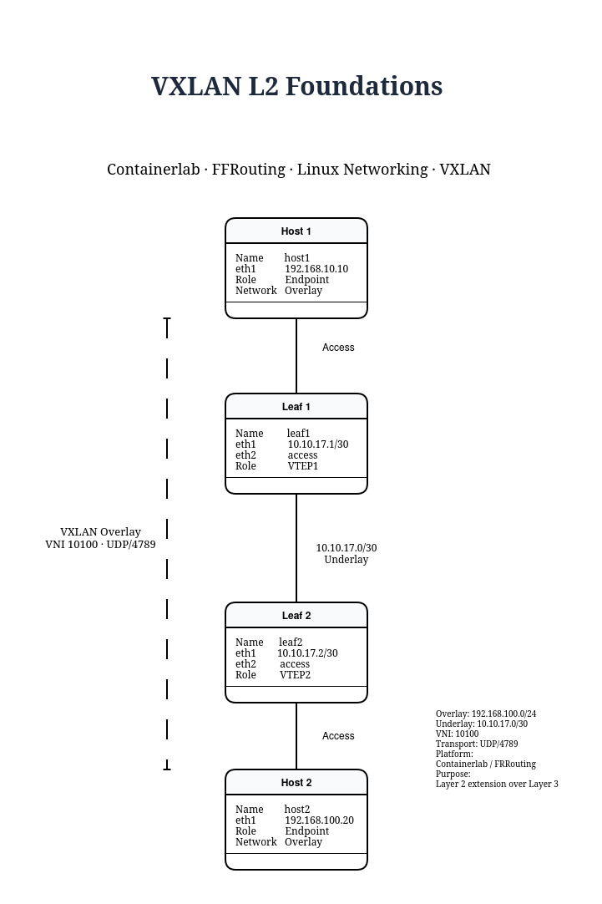
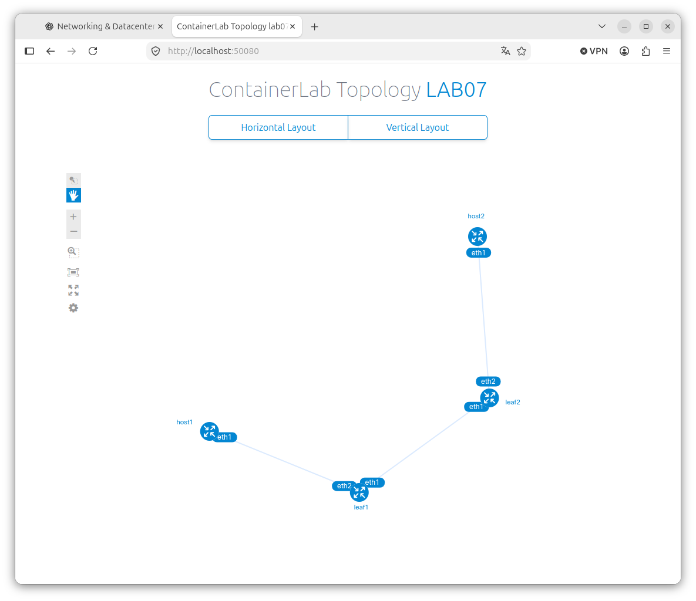
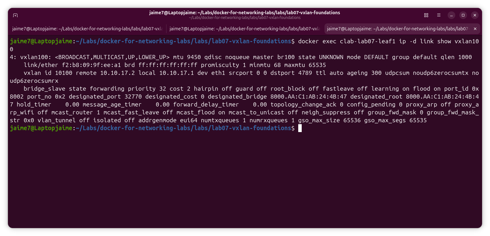
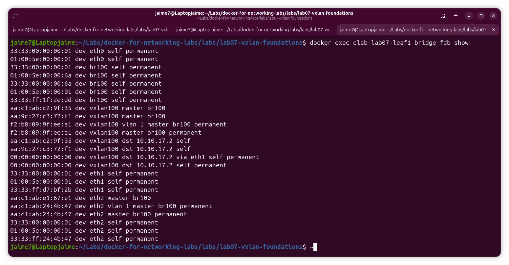
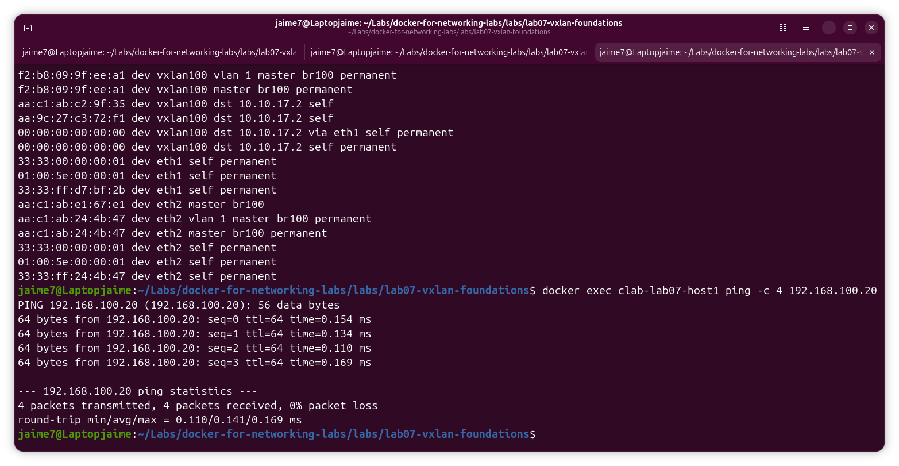
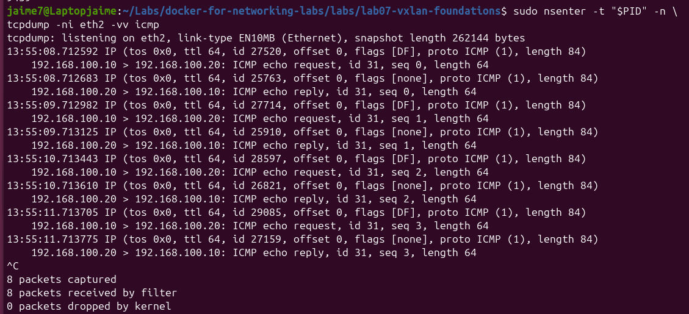
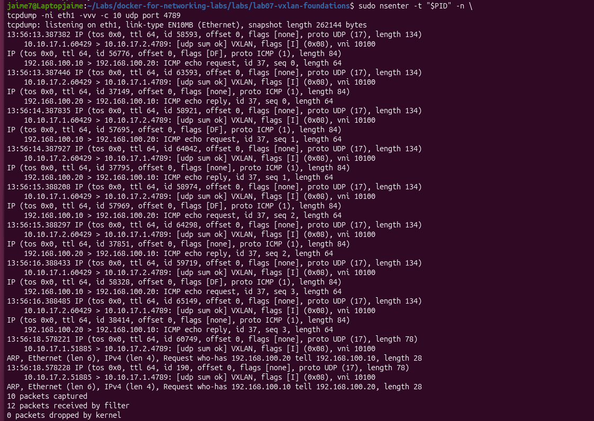

# Lab07 – VXLAN L2 Foundations with Containerlab

## Overview

This lab introduces **VXLAN Layer 2 extension** using **Containerlab**, **FRRouting**, and native **Linux networking**.

The goal is to extend the same Layer 2 segment across an IP underlay and observe how Ethernet traffic is encapsulated inside VXLAN.

The lab uses:

- Two Linux-based VTEPs
- A Layer 3 underlay
- Linux bridges
- VXLAN interfaces
- VNI 10100
- UDP port 4789
- Two hosts in the same overlay subnet

This lab intentionally focuses on **VXLAN data-plane fundamentals without EVPN**.

---

## Learning Objectives

By completing this lab, you will be able to:

- Understand the difference between **underlay** and **overlay**
- Identify the role of a **VTEP**
- Configure a Linux VXLAN interface
- Associate a VXLAN interface with a Linux bridge
- Understand the purpose of a **VNI**
- Extend a Layer 2 segment over a Layer 3 network
- Verify host-to-host connectivity through VXLAN
- Inspect the Linux bridge forwarding database
- Capture VXLAN traffic using `tcpdump`
- Observe the difference between inner and outer packet headers

---

## Technologies

- Containerlab
- Docker
- FRRouting
- Linux Networking
- Linux Bridge
- VXLAN
- tcpdump

---

## Topology



The lab consists of two VTEPs connected through a Layer 3 underlay.

```text
Host1
192.168.100.10/24
        |
        | Access
        |
Leaf1 / VTEP1
10.10.17.1/30
        |
        | IP Underlay
        |
Leaf2 / VTEP2
10.10.17.2/30
        |
        | Access
        |
Host2
192.168.100.20/24
```

VXLAN extends the Layer 2 network between both hosts:

```text
Overlay network: 192.168.100.0/24
VNI: 10100
Transport: UDP/4789
```

---

## Underlay and Overlay

VXLAN introduces two different network layers.

### Underlay

The underlay provides IP connectivity between the VTEPs.

```text
Leaf1: 10.10.17.1/30
Leaf2: 10.10.17.2/30
```

Network:

```text
10.10.17.0/30
```

The underlay only needs to provide IP reachability between the tunnel endpoints.

---

### Overlay

The overlay represents the logical Layer 2 segment extended through VXLAN.

```text
Host1: 192.168.100.10/24
Host2: 192.168.100.20/24
```

Both hosts behave as if they were connected to the same Ethernet LAN.

```text
192.168.100.0/24
```

even though their traffic crosses a separate Layer 3 network.

---

## What Is a VTEP?

A **VTEP** is a **VXLAN Tunnel Endpoint**.

The VTEP is responsible for:

- Encapsulating Ethernet frames into VXLAN
- Sending VXLAN packets across the IP underlay
- Receiving VXLAN packets
- Decapsulating them back into Ethernet frames

In this lab:

```text
Leaf1 = VTEP1
Leaf2 = VTEP2
```

VTEP addresses:

```text
VTEP1: 10.10.17.1
VTEP2: 10.10.17.2
```

Conceptually:

```text
Host1
  |
Ethernet
  |
VTEP1
  |
VXLAN / UDP / IP
  |
IP Underlay
  |
VTEP2
  |
Ethernet
  |
Host2
```

---

## VXLAN Network Identifier

The VXLAN segment uses:

```text
VNI 10100
```

The VNI identifies the logical Layer 2 segment.

It performs a role similar to a VLAN identifier, but VXLAN supports a much larger identifier space.

In this lab:

```text
192.168.100.0/24
        |
     VNI 10100
```

---

## Project Structure

```text
lab07-vxlan-foundations/
├── configs/
│   ├── leaf1/
│   │   ├── daemons
│   │   ├── frr.conf
│   │   └── vtysh.conf
│   └── leaf2/
│       ├── daemons
│       ├── frr.conf
│       └── vtysh.conf
│
├── scripts/
│   ├── leaf1-vxlan.sh
│   └── leaf2-vxlan.sh
│
├── images/
│   ├── lab07-vxlan-foundations-topology.png
│   ├── containerlab-graph.png
│   ├── vxlan-interface-leaf1.png
│   ├── bridge-fdb-leaf1.png
│   ├── host1-host2-ping.png
│   ├── vxlan-inner-traffic-eth2.png
│   └── vxlan-encapsulation-eth1.png
│
├── lab07.clab.yml
└── README.md
```

---

## Containerlab Topology

The topology is defined in:

```text
lab07.clab.yml
```

Example:

```yaml
name: lab07

mgmt:
  network: clab07
  ipv4-subnet: 172.30.70.0/24

topology:
  nodes:

    leaf1:
      kind: linux
      image: frrouting/frr:latest
      binds:
        - ./configs/leaf1:/etc/frr

    leaf2:
      kind: linux
      image: frrouting/frr:latest
      binds:
        - ./configs/leaf2:/etc/frr

    host1:
      kind: linux
      image: alpine:latest
      exec:
        - ip addr add 192.168.100.10/24 dev eth1
        - ip link set eth1 up

    host2:
      kind: linux
      image: alpine:latest
      exec:
        - ip addr add 192.168.100.20/24 dev eth1
        - ip link set eth1 up

  links:

    - endpoints:
        - leaf1:eth1
        - leaf2:eth1

    - endpoints:
        - host1:eth1
        - leaf1:eth2

    - endpoints:
        - host2:eth1
        - leaf2:eth2
```

---

## Containerlab Graph

Containerlab can automatically generate a visual representation of the topology.

Run:

```bash
containerlab graph -t lab07.clab.yml
```

Then open:

```text
http://localhost:50080
```

Example:



This provides a useful automatic validation of node and interface relationships.

---

## Deploy the Lab

Deploy the topology:

```bash
containerlab deploy -t lab07.clab.yml
```

Verify the nodes:

```bash
containerlab inspect -t lab07.clab.yml
```

Expected nodes:

```text
leaf1
leaf2
host1
host2
```

---

## Underlay Configuration

### Leaf1

```text
interface eth1
 ip address 10.10.17.1/30
```

### Leaf2

```text
interface eth1
 ip address 10.10.17.2/30
```

Verify:

```bash
docker exec clab-lab07-leaf1 vtysh -c "show interface brief"
docker exec clab-lab07-leaf2 vtysh -c "show interface brief"
```

---

## Underlay Verification

Before configuring VXLAN, verify VTEP reachability.

From Leaf1:

```bash
docker exec clab-lab07-leaf1 ping -c 4 10.10.17.2
```

Expected result:

```text
0% packet loss
```

This step is important because VXLAN depends on a working IP underlay.

The troubleshooting order should always be:

```text
Underlay
   ↓
VXLAN interface
   ↓
Bridge
   ↓
Overlay
```

---

## Linux Bridge Configuration

Each leaf uses a Linux bridge named:

```text
br100
```

The bridge connects:

```text
Host-facing interface
        +
VXLAN interface
```

Conceptually:

```text
eth2
  \
   br100
  /
vxlan100
```

This allows Ethernet frames received from the host-facing port to be forwarded into the VXLAN tunnel.

---

## VXLAN Configuration

### Leaf1

```bash
ip link add br100 type bridge
ip link set br100 up

ip link set eth2 master br100
ip link set eth2 up

ip link add vxlan100 type vxlan \
    id 10100 \
    local 10.10.17.1 \
    remote 10.10.17.2 \
    dstport 4789 \
    dev eth1

ip link set vxlan100 master br100
ip link set vxlan100 up

bridge fdb append 00:00:00:00:00:00 \
    dev vxlan100 \
    dst 10.10.17.2
```

---

### Leaf2

```bash
ip link add br100 type bridge
ip link set br100 up

ip link set eth2 master br100
ip link set eth2 up

ip link add vxlan100 type vxlan \
    id 10100 \
    local 10.10.17.2 \
    remote 10.10.17.1 \
    dstport 4789 \
    dev eth1

ip link set vxlan100 master br100
ip link set vxlan100 up

bridge fdb append 00:00:00:00:00:00 \
    dev vxlan100 \
    dst 10.10.17.1
```

---

## VXLAN Interface Verification

Verify the VXLAN interface:

```bash
docker exec clab-lab07-leaf1 \
ip -d link show vxlan100
```

Important values:

```text
vxlan id 10100
remote 10.10.17.2
local 10.10.17.1
dev eth1
dstport 4789
```

Example:



This confirms:

```text
VNI: 10100
Local VTEP: 10.10.17.1
Remote VTEP: 10.10.17.2
Transport: UDP/4789
```

---

## Bridge Verification

Verify the bridge:

```bash
docker exec clab-lab07-leaf1 bridge link
```

Expected:

```text
eth2      master br100
vxlan100  master br100
```

This confirms that the access interface and VXLAN interface belong to the same Layer 2 bridge.

---

## Bridge Forwarding Database

The Linux bridge maintains a forwarding database similar to the MAC address table of an Ethernet switch.

Run:

```bash
docker exec clab-lab07-leaf1 bridge fdb show
```

Example:



One important entry is:

```text
00:00:00:00:00:00 dev vxlan100 dst 10.10.17.2
```

This entry is used for traffic whose destination MAC is not yet known.

It allows traffic to be sent toward the remote VTEP.

This behavior is relevant for:

```text
BUM traffic
```

where BUM stands for:

- Broadcast
- Unknown Unicast
- Multicast

---

## End-to-End Overlay Connectivity

Test Host1 to Host2:

```bash
docker exec clab-lab07-host1 \
ping -c 4 192.168.100.20
```

Expected:

```text
0% packet loss
```

Example:



This proves that both hosts communicate successfully through the VXLAN overlay.

---

## What Happens to the Packet?

Host1 sends:

```text
Source IP:      192.168.100.10
Destination IP: 192.168.100.20
```

Leaf1 receives the Ethernet frame and encapsulates it into VXLAN.

The resulting packet contains:

```text
Outer Ethernet
Outer IP
UDP
VXLAN Header
Inner Ethernet
Inner IP
ICMP
```

Conceptually:

```text
Original packet
192.168.100.10 → 192.168.100.20
           ↓
      VXLAN Header
       VNI 10100
           ↓
        UDP 4789
           ↓
Outer IP
10.10.17.1 → 10.10.17.2
```

---

## Capturing the Inner Traffic

The host-facing interface on Leaf1 is:

```text
eth2
```

Use the Leaf1 network namespace:

```bash
PID=$(docker inspect -f '{{.State.Pid}}' clab-lab07-leaf1)
```

Then:

```bash
sudo nsenter -t "$PID" -n \
tcpdump -ni eth2 -vv icmp
```

Generate traffic:

```bash
docker exec clab-lab07-host1 \
ping -c 4 192.168.100.20
```

The capture shows normal ICMP traffic:

```text
192.168.100.10 → 192.168.100.20
```

Example:



At this point, the packet has not yet been encapsulated into VXLAN.

---

## Capturing VXLAN Encapsulation

Capture traffic on the underlay interface:

```bash
sudo nsenter -t "$PID" -n \
tcpdump -ni eth1 -vvv udp port 4789
```

Generate the same ping again.

Now the capture shows:

```text
10.10.17.1 → 10.10.17.2
UDP 4789
VXLAN
VNI 10100
```

while the original packet remains encapsulated inside.

Example:



This demonstrates the difference between:

```text
INNER TRAFFIC

192.168.100.10
        ↓
192.168.100.20
```

and:

```text
OUTER TRANSPORT

10.10.17.1
     ↓
UDP/4789
VXLAN VNI 10100
     ↓
10.10.17.2
```

---

## Packet Encapsulation Model

The full VXLAN packet can be visualized as:

```text
+-----------------------------+
| Outer Ethernet              |
+-----------------------------+
| Outer IP                    |
| 10.10.17.1 → 10.10.17.2    |
+-----------------------------+
| UDP                         |
| Destination Port 4789       |
+-----------------------------+
| VXLAN Header                |
| VNI 10100                   |
+-----------------------------+
| Inner Ethernet              |
+-----------------------------+
| Inner IP                    |
| 192.168.100.10 → .20        |
+-----------------------------+
| ICMP                        |
+-----------------------------+
```

This is the key concept behind VXLAN:

> Layer 2 Ethernet traffic is transported across a Layer 3 IP network.

---

## Troubleshooting

### Underlay Connectivity Fails

Check interface addressing:

```bash
docker exec clab-lab07-leaf1 \
vtysh -c "show interface brief"
```

Verify:

```text
Leaf1: 10.10.17.1/30
Leaf2: 10.10.17.2/30
```

Then test:

```bash
docker exec clab-lab07-leaf1 \
ping -c 4 10.10.17.2
```

If the underlay does not work, VXLAN will not work.

---

### VXLAN Interface Missing

Check:

```bash
docker exec clab-lab07-leaf1 \
ip -d link show vxlan100
```

Possible causes:

- VXLAN interface was not created
- Incorrect VNI
- Incorrect local VTEP IP
- Incorrect remote VTEP IP
- Incorrect underlay interface

---

### Bridge Misconfiguration

Verify:

```bash
docker exec clab-lab07-leaf1 bridge link
```

Both interfaces must belong to:

```text
br100
```

Expected:

```text
eth2
vxlan100
```

---

### Host-to-Host Ping Fails

Check the following in order:

```text
1. Host IP configuration
2. Access interfaces
3. Linux bridge
4. VXLAN interface
5. VNI
6. Remote VTEP
7. Underlay reachability
8. Bridge FDB
```

This layered troubleshooting approach avoids debugging the overlay before the underlay is validated.

---

### tcpdump Not Available Inside the FRR Container

The FRRouting container used in this lab does not include `tcpdump`.

Instead of modifying the container, obtain its PID:

```bash
docker inspect -f '{{.State.Pid}}' clab-lab07-leaf1
```

and use the Ubuntu host's `tcpdump` inside the container network namespace:

```bash
sudo nsenter -t "$PID" -n \
tcpdump -ni eth1
```

This is a useful Linux networking troubleshooting technique.

---

## Verification Commands

### Containerlab

```bash
containerlab inspect -t lab07.clab.yml
```

```bash
containerlab graph -t lab07.clab.yml
```

---

### Interfaces

```bash
docker exec clab-lab07-leaf1 \
vtysh -c "show interface brief"
```

```bash
docker exec clab-lab07-leaf2 \
vtysh -c "show interface brief"
```

---

### VXLAN

```bash
docker exec clab-lab07-leaf1 \
ip -d link show vxlan100
```

```bash
docker exec clab-lab07-leaf2 \
ip -d link show vxlan100
```

---

### Linux Bridge

```bash
docker exec clab-lab07-leaf1 bridge link
```

```bash
docker exec clab-lab07-leaf1 bridge fdb show
```

---

### Underlay Connectivity

```bash
docker exec clab-lab07-leaf1 \
ping -c 4 10.10.17.2
```

---

### Overlay Connectivity

```bash
docker exec clab-lab07-host1 \
ping -c 4 192.168.100.20
```

---

### Packet Capture

Host-facing traffic:

```bash
sudo nsenter -t "$PID" -n \
tcpdump -ni eth2 -vv icmp
```

VXLAN traffic:

```bash
sudo nsenter -t "$PID" -n \
tcpdump -ni eth1 -vvv udp port 4789
```

---

## Destroy the Lab

Remove the topology:

```bash
containerlab destroy -t lab07.clab.yml
```

Verify:

```bash
docker ps -a --filter "name=clab-lab07"
```

and:

```bash
docker network ls | grep clab07
```

---

## Key Takeaways

### 1. VXLAN Extends Layer 2 Across Layer 3

Host1 and Host2 belong to:

```text
192.168.100.0/24
```

even though the VTEPs communicate through:

```text
10.10.17.0/30
```

---

### 2. VTEPs Perform Encapsulation and Decapsulation

Leaf1 and Leaf2 act as VXLAN tunnel endpoints.

They translate between:

```text
Ethernet
```

and:

```text
VXLAN over UDP/IP
```

---

### 3. The VNI Identifies the Overlay Segment

This lab uses:

```text
VNI 10100
```

Both VTEPs must use the same VNI for the same Layer 2 segment.

---

### 4. VXLAN Uses UDP Port 4789

The original host traffic is transported inside:

```text
UDP/4789
```

between the VTEP addresses.

---

### 5. Underlay and Overlay Must Be Troubleshot Separately

The correct order is:

```text
Underlay
   ↓
VTEP reachability
   ↓
VXLAN
   ↓
Bridge
   ↓
Overlay
   ↓
Application traffic
```

---

### 6. Packet Capture Makes Encapsulation Visible

On the host-facing interface:

```text
192.168.100.10 → 192.168.100.20
```

On the underlay interface:

```text
10.10.17.1 → 10.10.17.2
UDP/4789
VNI 10100
```

This provides direct evidence of VXLAN encapsulation.

---

## Next Lab

The next logical step is to replace the static VXLAN control mechanism with:

```text
BGP EVPN
```

This will introduce:

- EVPN address family
- MAC/IP route advertisement
- Dynamic VTEP discovery
- BGP control plane
- VXLAN data plane
- Underlay and overlay separation

---

## Author

**NetworkJR7**

Hands-on networking labs focused on:

- Enterprise Networking
- BGP
- OSPF
- FRRouting
- Docker
- Containerlab
- Linux Networking
- VXLAN
- EVPN
- Datacenter Networking
- Network Automation
