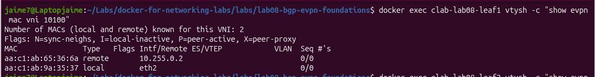
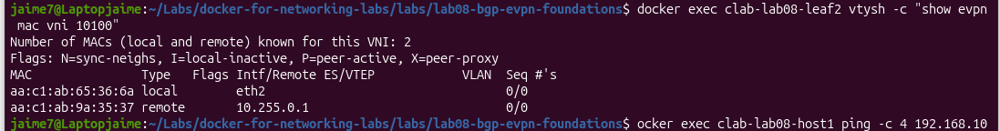
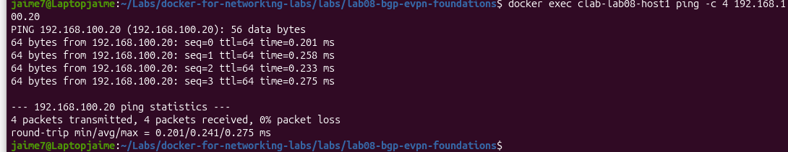

# Lab08 – BGP EVPN Foundations with VXLAN

## Overview

This lab introduces **BGP EVPN as the control plane for VXLAN** using Containerlab, FRRouting and Linux networking.

The previous VXLAN lab used a statically configured remote VTEP.

In this lab, VXLAN forwarding information is dynamically distributed through **BGP EVPN**.

The topology uses:

- Two Leaf switches acting as VTEPs
- One Spine router providing the IP underlay
- eBGP for underlay routing
- eBGP EVPN between Leaf loopbacks
- VXLAN VNI 10100
- Linux bridges
- EVPN Type-2 and Type-3 routes
- Route Targets
- Dynamic remote MAC learning

The final objective is to provide Layer 2 connectivity between Host1 and Host2 while using:

```text
BGP EVPN = Control Plane
VXLAN    = Data Plane
```

---

## Learning Objectives

By completing this lab, you will be able to:

- Build an eBGP-based IP underlay
- Use loopbacks as VTEP addresses
- Establish a BGP EVPN session between VTEPs
- Understand the separation between underlay and overlay
- Configure VXLAN without a static remote VTEP
- Understand EVPN Route Distinguishers and Route Targets
- Interpret EVPN Type-2 routes
- Interpret EVPN Type-3 IMET routes
- Verify remote MAC learning through EVPN
- Understand how EVPN programs the VXLAN data plane
- Troubleshoot Route Target mismatches
- Validate end-to-end Layer 2 connectivity

---

## Technologies

- Containerlab
- Docker
- FRRouting
- BGP
- BGP EVPN
- VXLAN
- Linux Networking
- Linux Bridge

---

## Topology

```text
                         Spine
                        AS65000
                   10.255.0.254/32
                     /          \
                    /            \
                 eBGP            eBGP
                  /                \
                 /                  \
             Leaf1                 Leaf2
            AS65101               AS65102
         VTEP 10.255.0.1       VTEP 10.255.0.2
               |                      |
             Host1                  Host2
       192.168.100.10/24     192.168.100.20/24
```

The Spine participates only in the **underlay**.

The Leafs participate in both:

```text
Underlay routing
+
EVPN overlay
+
VXLAN data plane
```

---

## Addressing Plan

| Node | Interface | Address | AS | Purpose |
|---|---|---:|---:|---|
| Leaf1 | eth1 | 10.10.18.1/30 | 65101 | Underlay |
| Leaf1 | lo | 10.255.0.1/32 | 65101 | Router ID / VTEP |
| Spine | eth1 | 10.10.18.2/30 | 65000 | Underlay |
| Spine | eth2 | 10.10.18.6/30 | 65000 | Underlay |
| Spine | lo | 10.255.0.254/32 | 65000 | Router ID |
| Leaf2 | eth1 | 10.10.18.5/30 | 65102 | Underlay |
| Leaf2 | lo | 10.255.0.2/32 | 65102 | Router ID / VTEP |
| Host1 | eth1 | 192.168.100.10/24 | — | Overlay endpoint |
| Host2 | eth1 | 192.168.100.20/24 | — | Overlay endpoint |

Underlay networks:

```text
Leaf1 ↔ Spine
10.10.18.0/30

Spine ↔ Leaf2
10.10.18.4/30
```

Overlay:

```text
192.168.100.0/24
VNI 10100
UDP/4789
```

---

## Network Architecture

This lab separates three functions.

### Underlay

Provides IP connectivity between VTEP loopbacks.

```text
Leaf1 AS65101
     |
    eBGP
     |
Spine AS65000
     |
    eBGP
     |
Leaf2 AS65102
```

The underlay allows:

```text
10.255.0.1 ↔ 10.255.0.2
```

---

### EVPN Control Plane

Leaf1 and Leaf2 establish an eBGP EVPN session using their loopbacks.

```text
10.255.0.1 ======================= 10.255.0.2
                   BGP EVPN
```

EVPN distributes information such as:

```text
MAC addresses
VTEP information
VNI membership
```

---

### VXLAN Data Plane

Actual host traffic is transported through VXLAN.

```text
Host1
192.168.100.10
       |
     Leaf1
       |
      VXLAN
     VNI 10100
       |
     Leaf2
       |
Host2
192.168.100.20
```

---

## Project Structure

```text
lab08-bgp-evpn-foundations/
├── configs/
│   ├── leaf1/
│   │   ├── daemons
│   │   ├── frr.conf
│   │   └── vtysh.conf
│   ├── spine/
│   │   ├── daemons
│   │   ├── frr.conf
│   │   └── vtysh.conf
│   └── leaf2/
│       ├── daemons
│       ├── frr.conf
│       └── vtysh.conf
│
├── scripts/
│   ├── leaf1-vxlan.sh
│   └── leaf2-vxlan.sh
│
├── images/
│   ├── evpn-mac-leaf1.png
│   ├── evpn-mac-leaf2.png
│   └── host1-host2-evpn-ping.png
│
├── lab08.clab.yml
└── README.md
```

---

# Phase 1 – Build the Underlay

The first step is to establish basic IPv4 routing.

The troubleshooting principle is:

```text
Underlay first
Overlay second
VXLAN last
```

EVPN should not be configured until VTEP loopback reachability is working.

---

## Leaf1 Underlay

```text
interface eth1
 ip address 10.10.18.1/30
!
interface lo
 ip address 10.255.0.1/32
```

BGP:

```text
router bgp 65101
 bgp router-id 10.255.0.1
 neighbor 10.10.18.2 remote-as 65000
 !
 address-family ipv4 unicast
  network 10.255.0.1/32
  neighbor 10.10.18.2 route-map PERMIT-ALL in
  neighbor 10.10.18.2 route-map PERMIT-ALL out
 exit-address-family
```

---

## Spine Underlay

```text
interface eth1
 ip address 10.10.18.2/30
!
interface eth2
 ip address 10.10.18.6/30
!
interface lo
 ip address 10.255.0.254/32
```

BGP:

```text
router bgp 65000
 bgp router-id 10.255.0.254

 neighbor 10.10.18.1 remote-as 65101
 neighbor 10.10.18.5 remote-as 65102

 address-family ipv4 unicast
  network 10.255.0.254/32

  neighbor 10.10.18.1 route-map PERMIT-ALL in
  neighbor 10.10.18.1 route-map PERMIT-ALL out

  neighbor 10.10.18.5 route-map PERMIT-ALL in
  neighbor 10.10.18.5 route-map PERMIT-ALL out
 exit-address-family
```

The Spine provides IP transit only.

It is not a VTEP.

---

## Leaf2 Underlay

```text
interface eth1
 ip address 10.10.18.5/30
!
interface lo
 ip address 10.255.0.2/32
```

BGP:

```text
router bgp 65102
 bgp router-id 10.255.0.2
 neighbor 10.10.18.6 remote-as 65000
 !
 address-family ipv4 unicast
  network 10.255.0.2/32
  neighbor 10.10.18.6 route-map PERMIT-ALL in
  neighbor 10.10.18.6 route-map PERMIT-ALL out
 exit-address-family
```

---

# Underlay Verification

Check BGP:

```bash
docker exec clab-lab08-leaf1 \
vtysh -c "show bgp summary"
```

```bash
docker exec clab-lab08-spine \
vtysh -c "show bgp summary"
```

```bash
docker exec clab-lab08-leaf2 \
vtysh -c "show bgp summary"
```

The Spine should have two established peers:

```text
10.10.18.1   AS65101
10.10.18.5   AS65102
```

---

## VTEP Reachability

Test the VTEP loopbacks:

```bash
docker exec clab-lab08-leaf1 \
ping -I 10.255.0.1 -c 4 10.255.0.2
```

and:

```bash
docker exec clab-lab08-leaf2 \
ping -I 10.255.0.2 -c 4 10.255.0.1
```

Expected:

```text
0% packet loss
```

At this point:

```text
Underlay eBGP               ✅
VTEP loopback reachability  ✅
```

---

# Phase 2 – BGP EVPN Control Plane

Leaf1 and Leaf2 establish an eBGP EVPN session using their loopback addresses.

The Spine does not participate in this EVPN session.

---

## Leaf1 EVPN Neighbor

```text
neighbor 10.255.0.2 remote-as 65102
neighbor 10.255.0.2 update-source 10.255.0.1
neighbor 10.255.0.2 ebgp-multihop 2
```

EVPN address-family:

```text
address-family l2vpn evpn
 neighbor 10.255.0.2 activate
 neighbor 10.255.0.2 route-map PERMIT-ALL in
 neighbor 10.255.0.2 route-map PERMIT-ALL out
 advertise-all-vni
exit-address-family
```

---

## Leaf2 EVPN Neighbor

```text
neighbor 10.255.0.1 remote-as 65101
neighbor 10.255.0.1 update-source 10.255.0.2
neighbor 10.255.0.1 ebgp-multihop 2
```

EVPN address-family:

```text
address-family l2vpn evpn
 neighbor 10.255.0.1 activate
 neighbor 10.255.0.1 route-map PERMIT-ALL in
 neighbor 10.255.0.1 route-map PERMIT-ALL out
 advertise-all-vni
exit-address-family
```

---

## Why `update-source`?

The EVPN session uses:

```text
Leaf1: 10.255.0.1
Leaf2: 10.255.0.2
```

These loopbacks are stable logical interfaces and will also be used as VTEP addresses.

---

## Why `ebgp-multihop`?

The EVPN peers are not directly connected.

The path is:

```text
Leaf1
  |
Spine
  |
Leaf2
```

Therefore the eBGP EVPN session must be allowed to cross an intermediate routed hop.

---

# EVPN Session Verification

Run:

```bash
docker exec clab-lab08-leaf1 \
vtysh -c "show bgp l2vpn evpn summary"
```

and:

```bash
docker exec clab-lab08-leaf2 \
vtysh -c "show bgp l2vpn evpn summary"
```

Initially the session can be established with:

```text
State/PfxRcd = 0
```

This is expected before a local VNI exists.

---

# Phase 3 – VXLAN Data Plane

Unlike the previous static VXLAN lab, there is no configured remote VTEP.

---

## Leaf1 VXLAN

```bash
ip link add br100 type bridge
ip link set br100 up

ip link set eth2 master br100
ip link set eth2 up

ip link add vxlan100 type vxlan \
    id 10100 \
    local 10.255.0.1 \
    dstport 4789 \
    nolearning

ip link set vxlan100 master br100
ip link set vxlan100 up
```

---

## Leaf2 VXLAN

```bash
ip link add br100 type bridge
ip link set br100 up

ip link set eth2 master br100
ip link set eth2 up

ip link add vxlan100 type vxlan \
    id 10100 \
    local 10.255.0.2 \
    dstport 4789 \
    nolearning

ip link set vxlan100 master br100
ip link set vxlan100 up
```

Notice that there is no:

```text
remote <VTEP-IP>
```

This is an important difference from static VXLAN.

---

# VNI Verification

Run:

```bash
docker exec clab-lab08-leaf1 \
vtysh -c "show evpn vni"
```

and:

```bash
docker exec clab-lab08-leaf2 \
vtysh -c "show evpn vni"
```

Expected:

```text
VNI 10100
Type L2
VxLAN IF vxlan100
```

---

# Route Target Troubleshooting

During the lab, the two Leafs initially generated different Route Targets.

Leaf1:

```text
RT:65101:10100
```

Leaf2:

```text
RT:65102:10100
```

Although the BGP EVPN session was established and EVPN routes were visible in the global EVPN table, both Leafs were not importing the same service routes into VNI 10100.

This produced asymmetric behavior.

For example:

```text
Leaf1
Remote VTEPs: 1

Leaf2
Remote VTEPs: 0
```

The session was working.

The EVPN service was not.

---

## Common Route Target

Both Leafs were configured with:

```text
RT 65000:10100
```

Leaf1:

```text
address-family l2vpn evpn
 vni 10100
  route-target import 65000:10100
  route-target export 65000:10100
 exit-vni
exit-address-family
```

Leaf2:

```text
address-family l2vpn evpn
 vni 10100
  route-target import 65000:10100
  route-target export 65000:10100
 exit-vni
exit-address-family
```

After this change, both Leafs correctly imported the EVPN routes associated with VNI 10100.

---

# RD vs RT

This lab demonstrates an important EVPN distinction.

## Route Distinguisher

The RD makes an EVPN route globally unique.

Examples:

```text
10.255.0.1:2
10.255.0.2:2
```

Different Leafs can advertise overlapping MAC/IP information while maintaining unique VPN routes.

---

## Route Target

The RT controls route import and export policy.

In this lab:

```text
RT 65000:10100
```

identifies routes belonging to the same EVPN service.

A useful way to remember the difference is:

```text
RD → makes the route unique

RT → determines who imports the route
```

---

# EVPN Routes

Verify:

```bash
docker exec clab-lab08-leaf1 \
vtysh -c "show bgp l2vpn evpn"
```

and:

```bash
docker exec clab-lab08-leaf2 \
vtysh -c "show bgp l2vpn evpn"
```

The lab generated two particularly important EVPN route types.

---

## EVPN Type-2

Example:

```text
[2]:[0]:[48]:[aa:c1:ab:9a:35:37]
```

Type-2 routes advertise MAC information.

Leaf1 advertises the MAC address locally connected through `eth2`.

Leaf2 receives that information through BGP EVPN.

The same process occurs in the opposite direction.

Conceptually:

```text
Host1 MAC
    |
  Leaf1
    |
EVPN Type-2
    |
  Leaf2
```

---

## EVPN Type-3

Example:

```text
[3]:[0]:[32]:[10.255.0.1]
```

Type-3 is the **Inclusive Multicast Ethernet Tag (IMET)** route.

It identifies a VTEP participating in a particular EVPN broadcast domain.

In this lab:

```text
Leaf1 advertises 10.255.0.1
Leaf2 advertises 10.255.0.2
```

for VNI 10100.

---

# Remote MAC Learning

Run on Leaf1:

```bash
docker exec clab-lab08-leaf1 \
vtysh -c "show evpn mac vni 10100"
```

Example:



Leaf1 shows:

```text
Local MAC  → eth2
Remote MAC → 10.255.0.2
```

This means Leaf1 knows that the remote host MAC is reachable through VTEP:

```text
10.255.0.2
```

---

Run on Leaf2:

```bash
docker exec clab-lab08-leaf2 \
vtysh -c "show evpn mac vni 10100"
```

Example:



Leaf2 sees the reverse relationship:

```text
Local MAC  → eth2
Remote MAC → 10.255.0.1
```

This demonstrates control-plane MAC distribution using EVPN.

---

# End-to-End Connectivity

Test:

```bash
docker exec clab-lab08-host1 \
ping -c 4 192.168.100.20
```

Result:

```text
4 packets transmitted
4 packets received
0% packet loss
```

Example:



This confirms:

```text
BGP EVPN control plane  ✅
VXLAN data plane        ✅
Host connectivity       ✅
```

---

# Control Plane vs Data Plane

This lab clearly separates the two.

## Control Plane

```text
BGP EVPN
```

distributes:

```text
MAC information
VTEP information
VNI membership
```

---

## Data Plane

```text
VXLAN
```

transports the actual Ethernet frames.

VXLAN still uses:

```text
UDP/4789
```

between:

```text
10.255.0.1
and
10.255.0.2
```

---

# Static VXLAN vs EVPN VXLAN

## Lab07 – Static VXLAN

```text
remote VTEP configured manually
```

Example:

```text
remote 10.10.17.2
```

The VTEP relationship was statically defined.

---

## Lab08 – BGP EVPN

No static remote VTEP is configured.

Instead:

```text
BGP EVPN
    ↓
Remote VTEP / MAC information
    ↓
VXLAN forwarding
```

This model scales much better for datacenter fabrics.

---

# Troubleshooting Workflow

A useful EVPN/VXLAN troubleshooting order is:

```text
1. Physical / Containerlab links
          ↓
2. Underlay interfaces
          ↓
3. Underlay eBGP
          ↓
4. VTEP loopback reachability
          ↓
5. BGP EVPN session
          ↓
6. VNI detection
          ↓
7. Route Targets
          ↓
8. EVPN routes
          ↓
9. Remote MAC installation
          ↓
10. VXLAN data plane
          ↓
11. Host connectivity
```

This prevents debugging VXLAN before the underlying transport is working.

---

# Useful Verification Commands

## Containerlab

```bash
containerlab inspect -t lab08.clab.yml
```

```bash
containerlab graph -t lab08.clab.yml
```

---

## Underlay Interfaces

```bash
docker exec clab-lab08-leaf1 \
vtysh -c "show interface brief"
```

```bash
docker exec clab-lab08-spine \
vtysh -c "show interface brief"
```

```bash
docker exec clab-lab08-leaf2 \
vtysh -c "show interface brief"
```

---

## Underlay BGP

```bash
docker exec clab-lab08-leaf1 \
vtysh -c "show bgp summary"
```

```bash
docker exec clab-lab08-spine \
vtysh -c "show bgp summary"
```

---

## IPv4 Routing

```bash
docker exec clab-lab08-leaf1 \
vtysh -c "show bgp ipv4 unicast"
```

---

## EVPN Session

```bash
docker exec clab-lab08-leaf1 \
vtysh -c "show bgp l2vpn evpn summary"
```

---

## EVPN Table

```bash
docker exec clab-lab08-leaf1 \
vtysh -c "show bgp l2vpn evpn"
```

---

## VNI

```bash
docker exec clab-lab08-leaf1 \
vtysh -c "show evpn vni"
```

---

## EVPN MAC Table

```bash
docker exec clab-lab08-leaf1 \
vtysh -c "show evpn mac vni 10100"
```

---

## Linux VXLAN Interface

```bash
docker exec clab-lab08-leaf1 \
ip -d link show vxlan100
```

---

## Linux Bridge FDB

```bash
docker exec clab-lab08-leaf1 \
bridge fdb show
```

---

## Overlay Connectivity

```bash
docker exec clab-lab08-host1 \
ping -c 4 192.168.100.20
```

---

# Destroy the Lab

```bash
containerlab destroy -t lab08.clab.yml
```

Verify:

```bash
docker ps -a --filter "name=clab-lab08"
```

and:

```bash
docker network ls | grep clab08
```

---

# Key Takeaways

## 1. The Underlay Provides Transport

The underlay must provide IP reachability between the VTEP loopbacks.

```text
10.255.0.1 ↔ 10.255.0.2
```

EVPN and VXLAN depend on this connectivity.

---

## 2. EVPN Is the Control Plane

BGP EVPN distributes endpoint and VTEP information.

It replaces the static remote-VTEP model used in the previous lab.

---

## 3. VXLAN Is the Data Plane

The actual host Ethernet traffic is encapsulated using:

```text
VXLAN
VNI 10100
UDP/4789
```

---

## 4. Type-2 Routes Advertise MAC Information

EVPN Type-2 routes allow one VTEP to learn endpoints located behind another VTEP.

---

## 5. Type-3 Routes Identify VTEP Participation

IMET routes advertise participation in the EVPN broadcast domain.

---

## 6. Route Targets Define EVPN Service Membership

An established EVPN session does not guarantee that routes will be imported into the correct VNI.

Both sides must use compatible Route Targets.

This lab demonstrated this directly.

---

## 7. An Established BGP Session Does Not Mean the Service Is Working

During troubleshooting:

```text
BGP EVPN = Established
```

but the VNI still showed asymmetric remote-VTEP information.

The root cause was:

```text
Route Target mismatch
```

This demonstrates why EVPN troubleshooting must go beyond checking only BGP neighbor state.

---

## 8. EVPN Programs Remote MAC Reachability

Each Leaf learned:

```text
Local MAC  → local access interface
Remote MAC → remote VTEP
```

This is one of the fundamental advantages of EVPN as a VXLAN control plane.

---

# Next Lab

The next step is to expand this foundation into a more complete:

```text
VXLAN / EVPN Fabric
```

Possible additions include:

```text
Multiple Leafs
Multiple VNIs
L2VNI
L3VNI
Anycast Gateway
Symmetric IRB
Spine-based EVPN route reflection
```

---

## Author

**NetworkJR7**

Hands-on networking labs focused on:

- Enterprise Networking
- BGP
- OSPF
- FRRouting
- Docker
- Containerlab
- Linux Networking
- VXLAN
- BGP EVPN
- Datacenter Networking
- Network Automation
