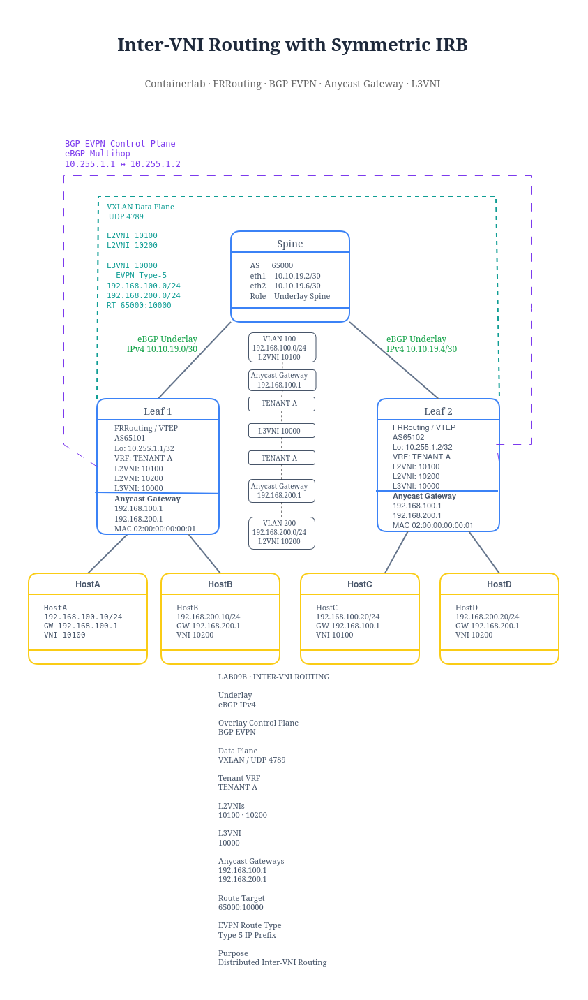
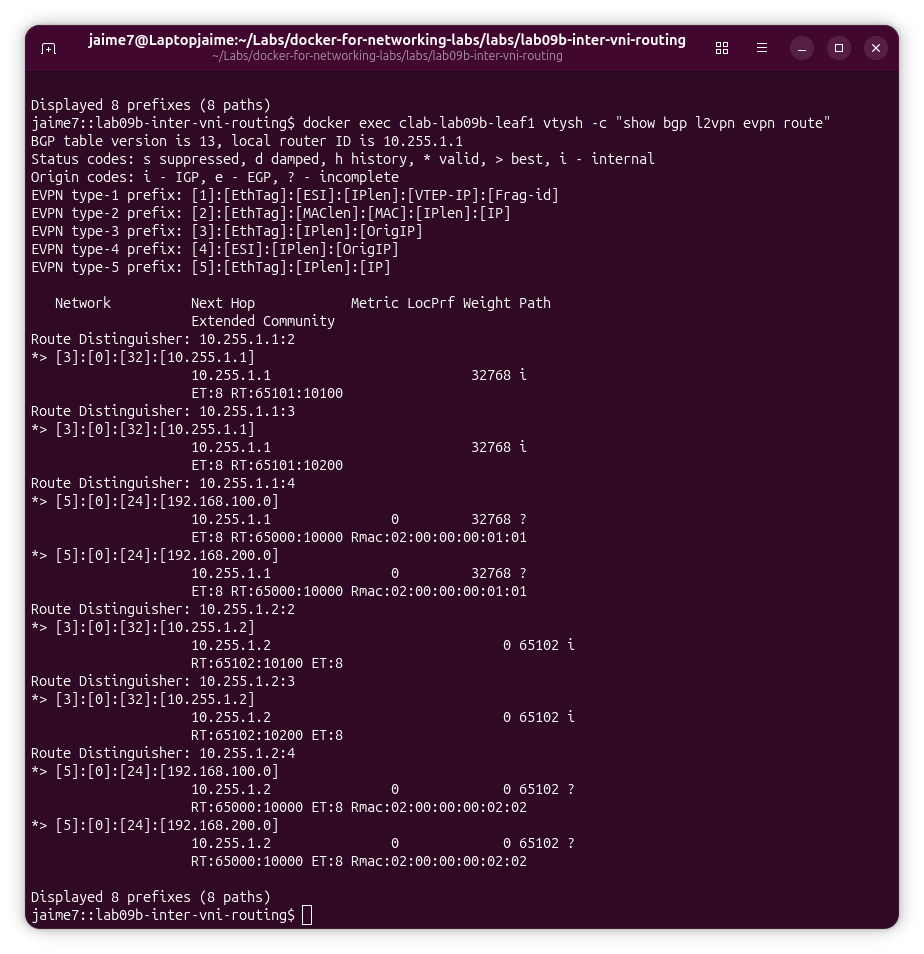
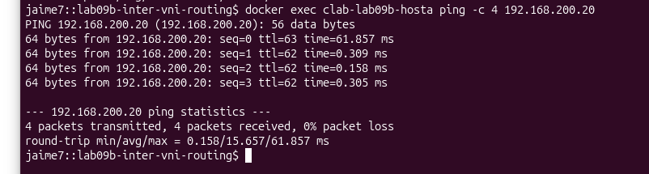
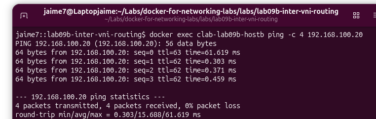

# Lab09B – Inter-VNI Routing with Symmetric IRB

This lab extends the previous Multi-VNI EVPN fabric by adding distributed Layer 3 routing between VXLAN segments.

The objective is to demonstrate:

- Anycast Gateway
- Tenant VRF
- L3VNI
- Symmetric IRB
- EVPN Type-5 IP Prefix routes
- Inter-VNI routing across a VXLAN/EVPN fabric

---

## Topology



---

## Addressing

### Underlay

| Device | Interface | Address |
|---|---|---|
| Leaf1 | eth1 | 10.10.19.1/30 |
| Spine | eth1 | 10.10.19.2/30 |
| Spine | eth2 | 10.10.19.6/30 |
| Leaf2 | eth1 | 10.10.19.5/30 |

### VTEP Loopbacks

```text
Leaf1: 10.255.1.1/32
Leaf2: 10.255.1.2/32
Spine: 10.255.1.254/32
```

---

## Tenant Segments

| Segment | Subnet | L2VNI | Gateway |
|---|---|---:|---|
| VLAN 100 | 192.168.100.0/24 | 10100 | 192.168.100.1 |
| VLAN 200 | 192.168.200.0/24 | 10200 | 192.168.200.1 |

Hosts:

```text
HostA 192.168.100.10/24
HostC 192.168.100.20/24

HostB 192.168.200.10/24
HostD 192.168.200.20/24
```

---

## Tenant VRF

Both VNIs belong to:

```text
VRF: TENANT-A
Linux routing table: 10
```

The tenant VRF contains both IP subnets:

```text
TENANT-A
├── 192.168.100.0/24
└── 192.168.200.0/24
```

---

## Anycast Gateway

Both Leafs provide the same default gateway IP and MAC address.

### VLAN 100

```text
Gateway IP: 192.168.100.1
```

### VLAN 200

```text
Gateway IP: 192.168.200.1
```

Anycast MAC:

```text
02:00:00:00:00:01
```

This allows hosts to use a local gateway regardless of which Leaf they are connected to.

---

## VXLAN VNIs

Three VNIs are used:

```text
L2VNI 10100
→ VLAN 100
→ 192.168.100.0/24

L2VNI 10200
→ VLAN 200
→ 192.168.200.0/24

L3VNI 10000
→ TENANT-A
→ Inter-VNI routing
```

VXLAN uses:

```text
UDP/4789
```

---

## L3VNI

The Layer 3 VNI provides the routing context between the two Layer 2 VNIs.

```text
L3VNI: 10000
VRF: TENANT-A
RT: 65000:10000
```

FRR correctly identifies the VNI as Layer 3:

```text
10000  L3  vxlan10000  TENANT-A
```

while:

```text
10100  L2  vxlan10100  TENANT-A
10200  L2  vxlan10200  TENANT-A
```

remain Layer 2 VNIs.

---

## Router MAC

Each Leaf uses a different router MAC for routed VXLAN traffic.

```text
Leaf1 Router MAC
02:00:00:00:01:01

Leaf2 Router MAC
02:00:00:00:02:02
```

These values are visible in the EVPN Type-5 routes.

---

## BGP EVPN Control Plane

The Leafs establish a direct BGP EVPN session between their VTEP loopbacks.

```text
Leaf1 AS65101
10.255.1.1

        BGP EVPN

Leaf2 AS65102
10.255.1.2
```

The Spine participates only in the IPv4 underlay.

---

## EVPN Type-5 Routes

The tenant prefixes are advertised through EVPN using Type-5 IP Prefix routes.



Example:

```text
[5]:[0]:[24]:[192.168.100.0]
RT:65000:10000
Rmac:02:00:00:00:01:01
```

and:

```text
[5]:[0]:[24]:[192.168.200.0]
RT:65000:10000
Rmac:02:00:00:00:01:01
```

Remote Type-5 routes are received from the other VTEP with its corresponding router MAC.

---

## Verification

### Underlay Reachability

Leaf1 to Leaf2 VTEP:

```bash
docker exec clab-lab09b-leaf1 \
ping -I 10.255.1.1 -c 4 10.255.1.2
```

Result:

```text
0% packet loss
```

Leaf2 to Leaf1:

```bash
docker exec clab-lab09b-leaf2 \
ping -I 10.255.1.2 -c 4 10.255.1.1
```

Result:

```text
0% packet loss
```

---

## EVPN VNI Verification

```bash
docker exec clab-lab09b-leaf1 \
vtysh -c "show evpn vni"
```

Expected:

```text
10100  L2  vxlan10100  TENANT-A
10200  L2  vxlan10200  TENANT-A
10000  L3  vxlan10000  TENANT-A
```

---

## VRF Verification

```bash
docker exec clab-lab09b-leaf1 \
vtysh -c "show vrf"
```

Example:

```text
vrf TENANT-A id 3 table 10
```

---

## Anycast Gateway Verification

HostA:

```bash
docker exec clab-lab09b-hosta \
ping -c 3 192.168.100.1
```

HostC:

```bash
docker exec clab-lab09b-hostc \
ping -c 3 192.168.100.1
```

HostB:

```bash
docker exec clab-lab09b-hostb \
ping -c 3 192.168.200.1
```

HostD:

```bash
docker exec clab-lab09b-hostd \
ping -c 3 192.168.200.1
```

All four hosts successfully reached their gateway.

---

## Inter-VNI Routing

The main validation of this lab is communication between different VNIs.





HostA:

```text
192.168.100.10
VNI 10100
```

to HostD:

```text
192.168.200.20
VNI 10200
```

Test:

```bash
docker exec clab-lab09b-hosta \
ping -c 4 192.168.200.20
```

Result:

```text
4 packets transmitted
4 packets received
0% packet loss
```

This confirms successful Inter-VNI routing.

---

## Symmetric IRB Traffic Flow

```text
HostA
192.168.100.10
      |
      v
Anycast Gateway
192.168.100.1
      |
      v
TENANT-A VRF
      |
      v
L3VNI 10000
      |
      v
VXLAN Fabric
      |
      v
Remote TENANT-A VRF
      |
      v
L2VNI 10200
      |
      v
HostD
192.168.200.20
```

The ingress VTEP performs Layer 3 routing into the tenant routing context.

The traffic is then transported across the fabric using the L3VNI and routed toward the destination Layer 2 VNI.

---

## EVPN Routing Table

Verification:

```bash
docker exec clab-lab09b-leaf1 \
vtysh -c "show bgp l2vpn evpn"
```

The EVPN table contains:

```text
Type-3 IMET routes
Type-5 IP Prefix routes
```

Type-5 prefixes:

```text
192.168.100.0/24
192.168.200.0/24
```

Route Target:

```text
65000:10000
```

---

## Troubleshooting

### L3VNI Initially Appeared as L2

During the lab, `show evpn vni` initially showed:

```text
10000 L2
```

instead of:

```text
10000 L3
```

The Linux VXLAN interface existed, but FRR had not yet associated VNI 10000 with the tenant IP-VRF.

The fix was:

```text
vrf TENANT-A
 vni 10000
exit-vrf
```

After applying the association:

```text
10000 L3 vxlan10000 TENANT-A
```

was correctly displayed.

This demonstrates that creating a VXLAN interface in Linux is not enough to define an L3VNI.

FRR must also associate the VNI with an IP-VRF.
---

## Layered Troubleshooting Method

This lab was built and validated in stages:

```text
1. Containerlab topology
2. eBGP underlay
3. VTEP reachability
4. BGP EVPN session
5. L2VNI 10100 / 10200
6. TENANT-A VRF
7. Anycast Gateway
8. L3VNI 10000
9. EVPN Type-5
10. Inter-VNI Routing
```

This approach makes it easier to identify which layer is responsible when the fabric does not behave as expected.

---

## Architecture Summary

```text
UNDERLAY
eBGP IPv4
Leaf1 --- Spine --- Leaf2

          ↓

OVERLAY CONTROL PLANE
BGP EVPN
Leaf1 <-----------> Leaf2

          ↓

L2 SERVICES
VNI 10100
VNI 10200

          ↓

DISTRIBUTED ROUTING
Anycast Gateway
TENANT-A VRF
L3VNI 10000

          ↓

EVPN ROUTING
Type-5 IP Prefix Routes
```

---

## Main Learning Outcomes

- EVPN/VXLAN Inter-VNI routing
- Symmetric IRB
- Anycast Gateway
- Tenant VRFs
- L2VNI vs L3VNI
- EVPN Type-5 routes
- Router MAC behavior
- Route Target based L3 service separation
- Distributed routing at the VTEP
- Layered EVPN troubleshooting

---

## Key Result

Lab09A demonstrated isolated Layer 2 VNIs:

```text
VNI 10100  X  VNI 10200
```

Lab09B adds distributed routing:

```text
L2VNI 10100
      |
      v
Anycast Gateway
      |
      v
L3VNI 10000
      |
      v
Anycast Gateway
      |
      v
L2VNI 10200
```

The result is successful communication between different tenant subnets across the EVPN/VXLAN fabric.
---

## Endpoint Convergence After Redeploy

After a complete Containerlab redeploy, the EVPN control plane was already operational:

```text
BGP EVPN      ✅
Type-3        ✅
Type-5        ✅
L3VNI 10000   ✅
Router MAC    ✅
```

However, initial Inter-VNI traffic failed for hosts whose MAC/IP information had not yet been learned and advertised through EVPN Type-2 routes.

For example, before HostC generated traffic, HostB could not reach:

```text
192.168.100.20
```

After HostC communicated with its local Anycast Gateway:

```bash
docker exec clab-lab09b-hostc \
ping -c 3 192.168.100.1
```

the remote Leaf learned the host endpoint and installed the corresponding remote host route through the L3VNI.

The Inter-VNI ping then succeeded:

```bash
docker exec clab-lab09b-hostb \
ping -c 4 192.168.100.20
```

Result:

```text
4 packets transmitted
4 packets received
0% packet loss
```

### Operational Lesson

An EVPN fabric can have:

```text
BGP EVPN          ✅
Type-5 prefixes   ✅
L3VNI             ✅
Router MAC        ✅
```

while specific endpoints are not yet fully converged.

Endpoint MAC/IP learning and EVPN Type-2 advertisements are still required for complete host reachability after a fresh redeploy.
